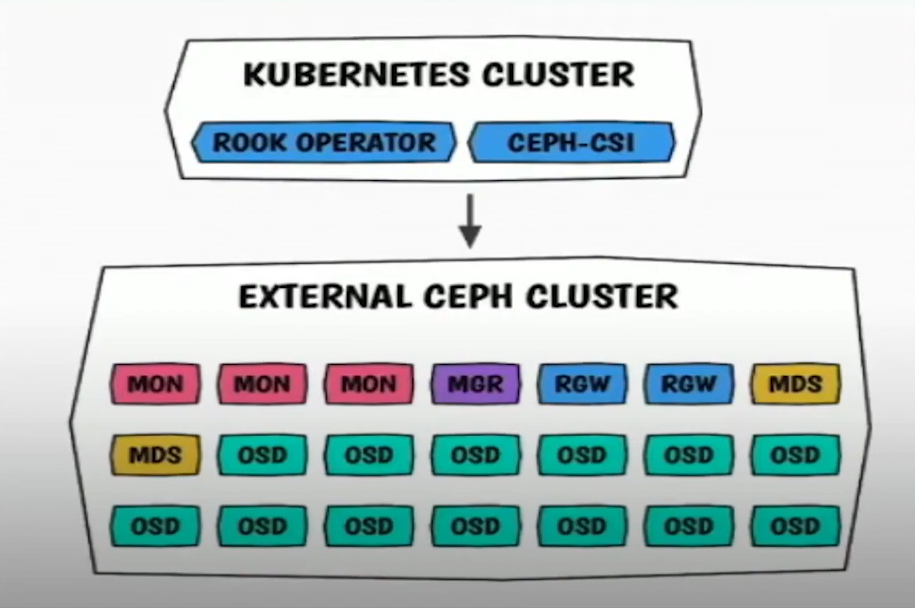

# CEPH-ROOK và triển khai ceph lên k8s.

## ROOK:
- Rook là một open-source storage orchestrator, được thiết kế để tạo, cấu hình và quản lý các giải pháp lưu trữ phân tán trên nền tảng K8s. Rook giúp đơn giản hóa việc triển khai và vận hành các hệ thống lưu trữ như Ceph, NFS, Minio, Cassandra, Yugabyte và nhiều giải pháp khác.

- Ceph ban đầu không được thiết kế cho k8s, mà ta phải chạy trực tiếp lên trên bare metal environments thông qua ceph-ansible.

- Sau này, khi các môi trường container dần được phát triển, ceph bắt đầu hỗ trợ môi trường này.

- Rook được sinh ra để triển khai ceph trên kubernetes. Nó giống như cephadm, là 1 lớp quản lý ceph. Có thể tự động triển khai ceph điều chỉnh tùy ý.
- Cấu trúc của một cụm CEPH - ROOK sẽ gồm 3 phần như sau:
 

- Rook Operator (lớp xanh dương): Rook Operator là một container đơn giản, có tất cả những gì cần thiết để khởi tạo và giám sát cluster storage. Nó tự động hóa việc cấu hình và điều khiển các thành phần Ceph trên Kubernetes. Nó chịu trách nhiệm triển khai, cấu hình và quản lý toàn bộ Ceph cluster.
- CSI plugins và provisioners (lớp cam): Đây là các plugin và provisioner của Ceph-CSI (Container Storage Interface). Chúng cung cấp khả năng cung cấp và gắn kết các khối lưu trữ Ceph vào các Pod Kubernetes. Rook tự động cấu hình trình điều khiển Ceph-CSI để gắn kết lưu trữ vào các pod. Image rook/ceph bao gồm tất cả các công cụ cần thiết để quản lý cluster. Rook không nằm trong đường dữ liệu Ceph. 

- Ceph daemons (lớp đỏ): Đây là các daemon của Ceph, là nhân của kiến trúc lưu trữ Ceph. Các daemon này bao gồm Monitor, Manager, OSD, v.v.

- Rook - Ceph có 2 loại cluster:
    - Host-based cluster: sử dụng các ổ đĩa trực tiếp từ các host trong cụm. Mỗi host sẽ có một hoặc nhiều ổ đĩa được phân bổ cho Ceph, và Ceph sẽ quản lý các ổ đĩa này để tạo ra một hệ thống lưu trữ phân tán. Mô hình này cho phép dễ dàng cấu hình và quản lý trực tiếp các tài nguyên lưu trữ, nhưng có thể gặp khó khăn trong việc mở rộng và quản lý khi số lượng nút tăng lên.
    
    - PVC-based cluster: sử dụng Persistent Volume Claims (PVC) trong Kubernetes để quản lý lưu trữ. Trong mô hình này, các yêu cầu về lưu trữ được định nghĩa trong Kubernetes, và Ceph sẽ tự động tạo và quản lý các persistent volumes dựa trên các PVC này. Điều này giúp việc tích hợp với các ứng dụng trên Kubernetes trở nên dễ dàng hơn, đồng thời cải thiện khả năng mở rộng và tính linh hoạt trong việc cung cấp tài nguyên lưu trữ, vì người dùng không cần quản lý trực tiếp các ổ đĩa vật lý.

## Cấu hình ROOK thông qua các file .yaml

- Để cấu hình và cài đặt rook, đầu tiên, ta cần phải clone git branch về:
```
git clone --single-branch --branch v1.15.0 https://github.com/rook/rook.git
```
- Chạy 3 file sau trong cụm k8s để tạo 1 rook-cluster-operator:
```
kubectl create -f crds.yaml -f common.yaml -f operator.yaml
```
- File crds.yaml chứa các CRD (Custom Resource Definitions) cho Rook. CRD cho phép Rook tạo ra các loại tài nguyên tùy chỉnh như CephCluster, CephBlockPool, và CephObjectStore. Điều này cho phép người dùng quản lý các cụm Ceph thông qua k8s.
- File common.yaml Chứa các cấu hình chung hoặc các tài nguyên cần thiết cho việc vận hành Rook, như Service Accounts, ClusterRoles, và RoleBindings. Những tài nguyên này thiết lập quyền truy cập và bảo mật cho các thành phần của Rook.
- File operator là để tạo ceph-rook operator, Chứa định nghĩa cho Rook Operator, là thành phần chính điều khiển và quản lý cụm Ceph. Operator theo dõi trạng thái của các tài nguyên Ceph và thực hiện các hành động cần thiết để duy trì và tự động hóa quản lý cụm.

- Ta bắt buộc phải chạy 3 file trên trước khi tạo 1 cụm ceph cluster. Sau khi chạy xong, ta có thể chọn 1 trong các file sau để tạo 1 cluster:
    - cluster.yaml, đây là file cấu hình cơ bản được sử dụng nhiều nhất, nhằm tạo ra một cụm ceph sử dụng các Persistent Volumes (PV) được quản lý tự động bởi Rook để lưu trữ dữ liệu.
    - cluster-on-pvc.yaml, sử dụng để triển khai một cụm Ceph dựa trên Persistent Volume Claims (PVC) đã được tạo trước, cho phép người dùng chỉ định các PVC cụ thể cho các OSD (Object Storage Daemon) trong cụm.
    - cluster-on-local-pvc.yaml tương tự như cluster-on-pvc.yaml, nhưng nó chỉ định rằng các PVC này sử dụng lưu trữ cục bộ.
    - cluster-stretched.yaml, được sử dụng để triển khai một cụm Ceph trải dài qua nhiều zones hoặc nhiều cụm k8s.
    - cluster-stretched-aws.yaml, tương tự như cluster-stretched.yaml, nhưng được tối ưu hóa cho môi trường AWS.
    - cluster-external.yaml và cluster-external-management.yaml
, sử dụng để kết nối một cụm Ceph bên ngoài với Rook. Yhay vì quản lý cụm Ceph hoàn toàn trong Kubernetes, file này cho phép Rook sử dụng một cụm Ceph đã tồn tại bên ngoài, giúp dễ dàng tích hợp và quản lý lưu trữ hiện có.

- Ngoài ra, ta có thể chỉnh cấu hình cho cụm ceph cluster thông qua file yaml:
```
...
  storage: 
    useAllNodes: true
    useAllDevices: true
    #deviceFilter:
    config:
      # crushRoot: "custom-root" # specify a non-default root label for the CRUSH map
      # metadataDevice: "md0" # specify a non-rotational storage so ceph-volume will use it as block db device of bluestore.
      # databaseSizeMB: "1024" # uncomment if the disks are smaller than 100 GB
      # osdsPerDevice: "1" # this value can be overridden at the node or device level
      # encryptedDevice: "true" # the default value for this option is "false"
      # deviceClass: "myclass" # specify a device class for OSDs in the cluster
    allowDeviceClassUpdate: false # whether to allow changing the device class of an OSD after it is created
    allowOsdCrushWeightUpdate: false # whether to allow resizing the OSD crush weight after osd pvc is increased
    # Individual nodes and their config can be specified as well, but 'useAllNodes' above must be set to false. Then, only the named
    # nodes below will be used as storage resources.  Each node's 'name' field should match their 'kubernetes.io/hostname' label.
    # nodes:
    #   - name: "172.17.4.201"
    #     devices: # specific devices to use for storage can be specified for each node
    #       - name: "sdb"
    #       - name: "nvme01" # multiple osds can be created on high performance devices
    #         config:
    #           osdsPerDevice: "5"
    #       - name: "/dev/disk/by-id/ata-ST4000DM004-XXXX" # devices can be specified using full udev paths
    #     config: # configuration can be specified at the node level which overrides the cluster level config
    #   - name: "172.17.4.301"
    #     deviceFilter: "^sd."
    # when onlyApplyOSDPlacement is false, will merge both placement.All() and placement.osd
    onlyApplyOSDPlacement: false
...
```
- Sau khi áp dụng file thông qua lệnh `kubectl apply -f <file-cluster>`, khi tất cả các pod đều chạy, ta cần chạy thêm file `toolbox.yaml` để khởi động dịch vụ tool box, từ đó ta mới có thể tương tác được với cụm ceph:
```
kubectl apply -f toolbox.yaml
kubectl -n rook-ceph get pods
kubectl -n rook-ceph exec -it rook-ceph-tools-<pod-id> -- /bin/bash
```
- Ở trong pods này, ta có thể chạy các lệnh như `ceph -s`, `ceph orch ls`.... như 1 cụm ceph thông thường.

## Các pod có trong 1 cụm rook-ceph:
- csi-cephfsplugin-provisione: là một phần của driver Ceph CSI (Container Storage Interface) dành cho CephFS, quản lý việc tạo và xóa các volume CephFS theo yêu cầu của Kubernetes, các bản snapshot của các volume,....
- csi-cephfsplugin: daemon plugin CephFS, kết nối volume CephFS với các ứng dụng đang chạy, tháo gỡ volume khi không cần thiết,...
- rook-ceph-operator: chạy operator của Rook, quản lý việc triển khai và quản lý liên tục cụm Ceph trong Kubernetes, bắt buộc là pod đầu tiên được dựng lên. Xử lý các tác vụ như mở rộng cụm, nâng cấp phiên bản Ceph, và quản lý các CRD (Custom Resource Definitions) đại diện cho tài nguyên Ceph
- rook-ceph-osd: chứa daemons osd
- rook-ceph-mgr: chứa daemons mgr
- rook-ceph-mon: chứa daemons monitor
- rook-ceph-osd-prepare: chịu trách nhiệm chuẩn bị các đĩa để sử dụng bởi các osd, chuẩn bị các đĩa (ví dụ: định dạng, phân vùng) để chúng có thể được sử dụng bởi các OSD, hoàn thành công việc với trạng thái completed thay vì running.
- rook-ceph-tools: cung cấp công cụ để tương tác với cụm Ceph, người sử dụng cần thông qua container này mới có thể quản lý, kiểm tra cụm ceph bằng các câu lệnh thông thường như `ceph -s`, `ceph orch`,....

## Áp dụng các dịch vụ như storage-class.
- Để tạo 1 storage class mới, ta cần sử dụng 

## Lợi ích của việc triển khai ceph rook vs cephadm:
- Khi triển khai ceph rook, ta có thể tách thành 2 cụm cluster riêng biệt với 1 cụm ceph và 1 cụm k8s:

- Nhờ đó, ta có thể triển khiển khai nhiều cụm k8s cluster và sử dụng cùng cùng 1 cụm ceph để tập trung hóa quản lý, khiến cho việc quản lí thuận tiện, cũng như giảm bớt tài nguyên duy trì nhiều cụm ceph khác nhau  :

- Ngoài ra, Rook  cũng giúp trừu tượng hóa nhiều khái niệm Ceph phức tạp như placement groups, crush maps, v.v. để cung cấp một trải nghiệm người dùng đơn giản hơn. Người dùng chỉ cần quan tâm đến các khái niệm chính như pool, bucket,....


