# Ceph 

## I. Định nghĩa về CEPH và RADOS:
- Ceph là 1 nền tảng mã nguồn mở, hệ thống lưu trữ bằng phần cứng, phát triển và bảo trì bởi Red Hat.
- Được sinh ra để tránh vấn đề sở hữu độc quyền của DataCenter.
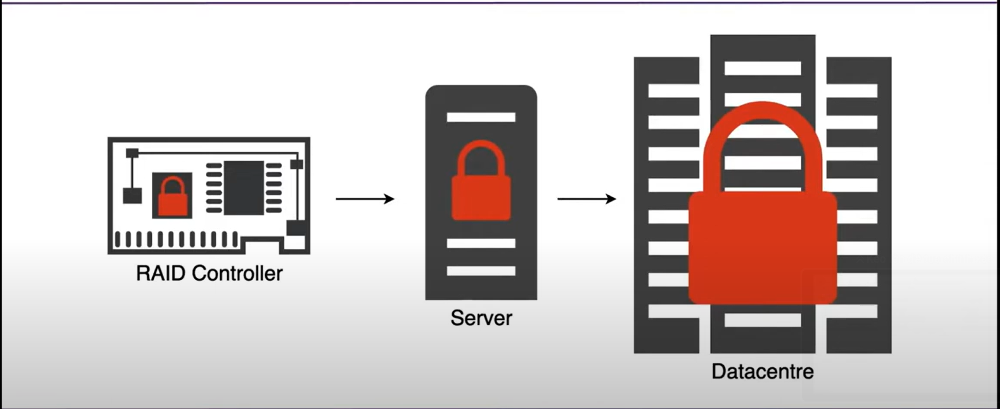
- Ceph là một (Software-Defined Storage): Hệ thống lưu trữ định dạng bằng phần mềm, trong đó phần mềm điều khiển các nhiệm vụ và chức năng liên quan đến lưu trữ độc lập với phần cứng cơ bản. SDS trừu tượng hóa tài nguyên lưu trữ khỏi phần cứng vật lý, cung cấp tính linh hoạt, mở rộng. Các lợi thế của SDS
    - Portable: Miễn chạy được linux là chạy được ceph
    - Abstract: tách rõ phần mềm và phần cứng
    - Extensible: 1 cụm có thể hỗ trợ nhiều protocol như smb, nfs,...
    - Scalability: Dễ dàng scale
    - Có Restful API

- Một object được đưa vào trong 1 cụm ceph, sẽ đi theo quá trình sau: Object -> Pools -> Placement Group -> OSD
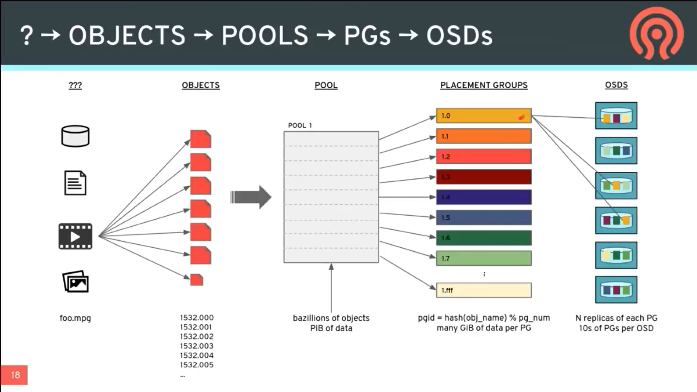


## II. Các thành phần trong 1 cụm Ceph:
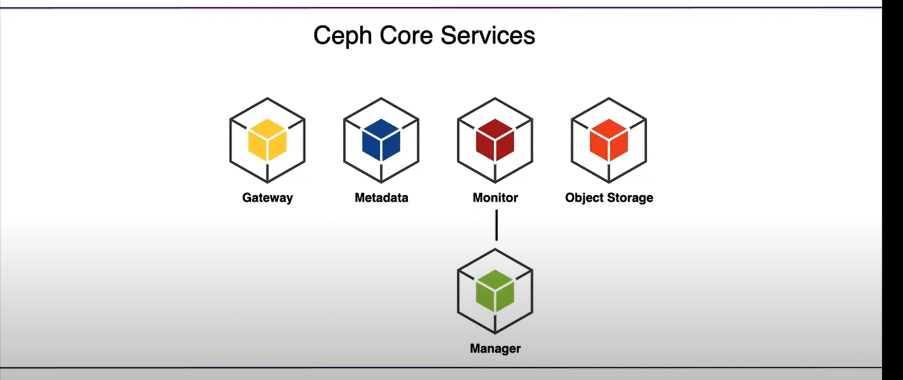
- Monitors: Một Ceph Monitor (ceph-mon) duy trì các bản đồ về trạng thái của cụm, bao gồm bản đồ monitor, bản đồ quản lý, bản đồ OSD, bản đồ MDS và bản đồ CRUSH. Những bản đồ này là trạng thái quan trọng của cụm cần thiết để các daemon Ceph phối hợp với nhau. Monitors cũng chịu trách nhiệm quản lý xác thực giữa các daemon và khách hàng. Thông thường cần ít nhất ba monitor để đảm bảo tính dự phòng và khả năng sẵn sàng cao.
    - Nếu tất cả các Monitor down thì cụm ceph cũng sẽ down, mất đi khả năng xác định vị trí của dữ liệu, thực hiện các thao tác đọc ghi. Đồng thời làm tăng nguy cơ mất dữ liệu khi có OSD down.
- Managers: Một tiến trình Ceph Manager (ceph-mgr) chịu trách nhiệm theo dõi các số liệu hoạt động và trạng thái hiện tại của cụm Ceph, bao gồm sử dụng lưu trữ, số liệu hiệu suất hiện tại và tải hệ thống. Các tiến trình Ceph Manager cũng chứa các mô-đun dựa trên Python để quản lý và tiết lộ thông tin về cụm Ceph, bao gồm Trang tổng quan Ceph dựa trên web và REST API. Thông thường cần ít nhất hai manager để đảm bảo khả năng sẵn có cao.
    - Nếu các manager bị down, cụm sẽ mất đi các số liệu hoạt động và trạng thái hiện tại, làm gián đoạn việc giám sát hiệu năng của cụm.
- Ceph OSDs: Một Ceph OSD (Object Storage Daemon, ceph-osd) lưu trữ dữ liệu chính, xử lý sao chép dữ liệu, phục hồi, cân bằng lại và cung cấp một số thông tin theo dõi cho Ceph Monitors và Managers bằng cách kiểm tra các tiến trình Ceph OSD khác. Thông thường cần ít nhất ba Ceph OSD để đảm bảo tính dự phòng và khả năng sẵn có cao.
    - Nếu 1 OSD down, kịch bản crush sẽ khôi phục lại số Placement Group có trên OSD đó trên các OSD khác. VD, nếu 1 OSD chứa 10 placement group bị lỗi, và trong pool đó, 1 Placement Group được lưu trên 3 OSD, thì sẽ có nhiều nhất ~10*3 = 30 OSD trong cụm diễn ra hoạt động backup, khôi phục lại 10 PGs đó trong cùng 1 thời điểm. Số lượng OSD tham gia vào quá trình hồi phục sẽ phục thuộc vào số replica set trong pool và số lượng OSD.

- MDSs: Một Máy Chủ Dữ Liệu Ceph (MDS, ceph-mds) lưu trữ dữ liệu về siêu dữ liệu cho Hệ thống Tệp Ceph. Máy Chủ Dữ Liệu Ceph cho phép người dùng CephFS chạy các lệnh cơ bản (như ls, find, v.v.) mà không gây áp lực lên Cụm Lưu Trữ Ceph.
- Gateway: Cổng giao tiếp giữa cụm ceph và client ở ngoài.
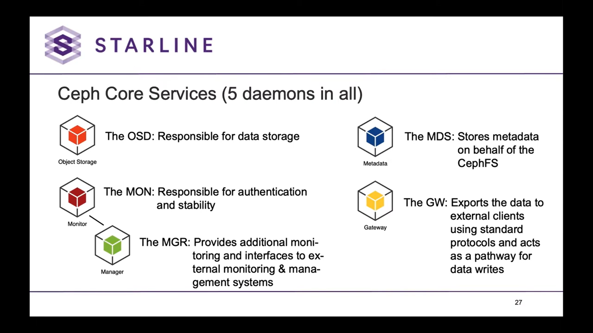


# III. PLACEMENT GROUP:
- Khi Ceph cluster nhận yêu cầu từ data storage, nó sẽ chia object vào các nhóm, chúng được là placement groups (PG). Sử dụng thuật toán CRUSH, tổ chức dữ liệu thành nhiều object dựa theo hash, id object và mức nhân bản.
- Tại sao lại có Placement Group? :
  - Có thể chia các Placement Group sang nhiều node OSD khác nhau, tăng tính HA, và mỗi OSD chỉ cần đáp ứng điều kiện là đủ dung lượng để chứa placement group đó, không quan trọng về thiết bị phần cứng phải giống nhau.
  - Số lượng PG trên các osd là khác nhau, tùy vào dung lượng và weight được set của OSD
  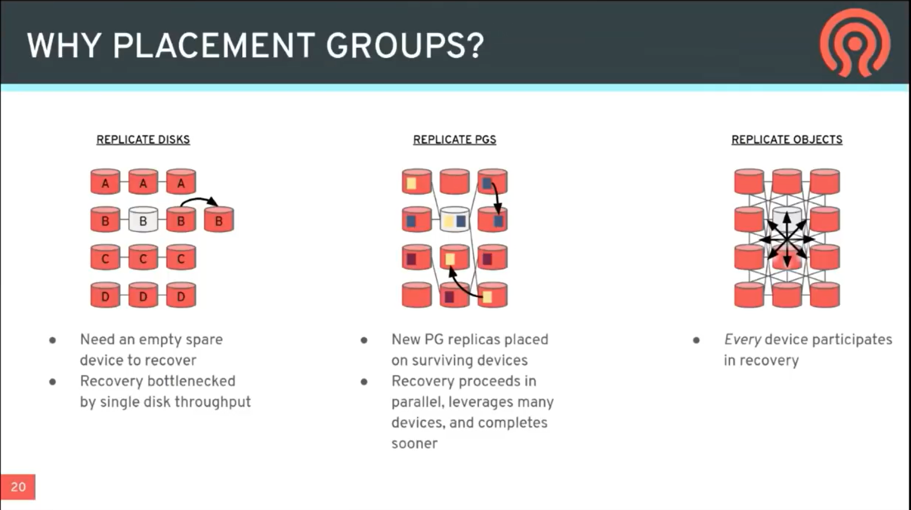
  - Nhiều Placement Group: Hồi phục nhanh hơn, dữ liệu được phân bố đều hơn, tuy nhiên dễ bị mất dữ liệu khi gặp >3-failure (Trong trường hợp lưu bằng EC)
  - Ít Placement Group: Hồi phục lâu hơn, nhưng sẽ tránh phần lớn các trường hợp bị mất data do >3-failure. 
  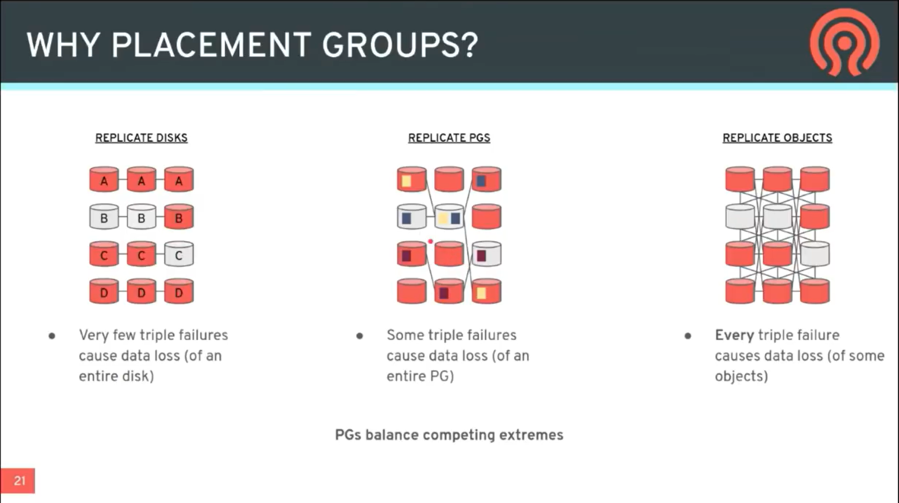
  => Cần tách data ra khắp các failure-domain cao như (rack, row, data center) để tránh sập mà làm mất data.
  
  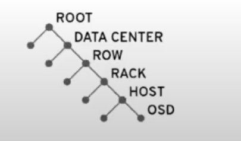
  - Số Placement group hợp lý thường được tính bằng:
  ```
  Total PGs = (Total_number_of_OSD * 100) / max_replication_count
  ```
  

# IV. POOL:
- Một logical partition để lưu trữ các object.
- Một RADOS Pool có thể lưu trữ dữ liệu và chia thành các placement group bằng 2 cách:
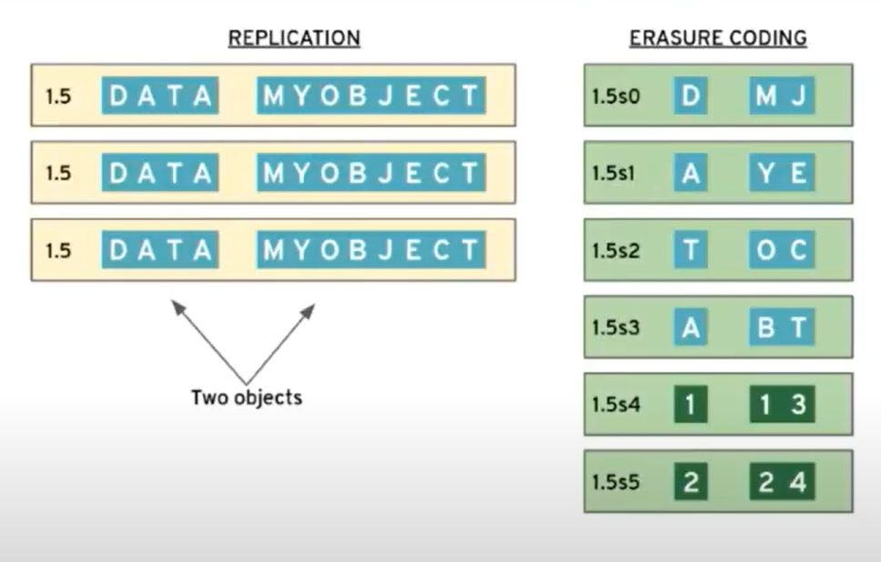
-  Replication: 
    - Lưu trữ hoàn toàn dữ liệu của object vào một placement group.
    - Thường sẽ là lưu trữ thành 3 bản.
    - Lưu mỗi placement group ở một osd theo luật CRUSH.
    - Hồi phục nhanh bằng cách đọc các copy còn sống.
- Erasure coding: 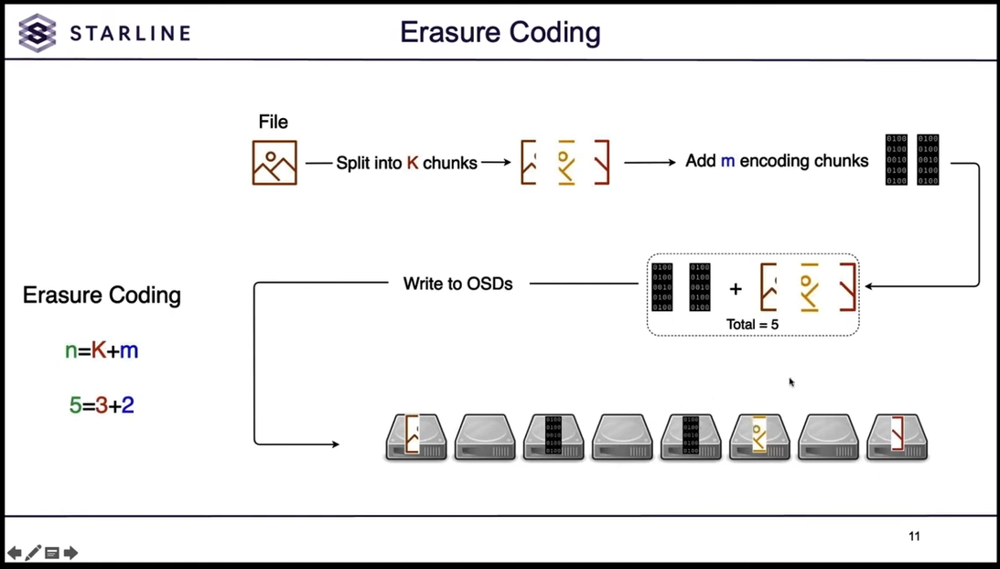
    - Mỗi PG "Shard" chứa một phần data.
    - Chia object thành K-shard.
    - Thêm m shard cho mỗi object cho parity/redundancy
    - Thường thì m = k/2 (50% Overhead)
    - Lưu trữ các shard lên các osd theo luật CRUSH
    - Thường dành cho các object lớn, ít thay đổi.
- Một cluster thường có thể chứa nhiều pool cùng 1 lúc. Và mỗi pool có thể có các luật khác nhau để lưu object để dễ dàng mở rộng, thay đổi linh hoạt:
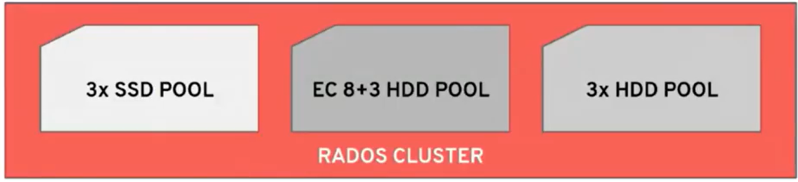
- Tạo pool bằng lênh sau:
```
ceph osd pool create <poolname> [<pg_num> [<pgp_num>]] <crush-rule-name> / {replicated|erasure} {replicated-num|erasure-code-profile}
[expected-num-objects]
```
- Với 
  - poolname: tên của pull
  - pg_num: số lượng placement_group có trong pool.
  - pgp_num: số lượng placement_group được cluster đề xuất nên có trong pool.
  - crush-rule-name: Tên luật áp dụng lên pool.
  - Repilcated/Erasure: cách lưu trữ dữ liệu trong pool (Rep hoặc EC)
  -  replicated: quyết định số lượng mỗi PG được sao chép trong pool
  -  erasure-code-profile: quyết định luật erasure coding theo [Document sau](https://docs.ceph.com/en/quincy/rados/operations/erasure-code-profile/).
  - Nếu tạo với cờ Bulk, autoscaler sẽ tạo 1 pool với đủ toàn bộ số lượng PG, sau đó scale down khi tỉ lệ sử dụng trên toàn bộ pool không được đồng đều.
  - Ngược lại, autoscaler sẽ tạo 1 pool với số lượng PG tối thiểu, và scale up mỗi khi có thêm 1 pg mới.
  - Bật hoặc tắt autoscale với --autoscale-mode {off/on/warn}
- Xem thông tin các pool trong cluster bằng lệnh:
```
ceph osd pool autoscale-status
```
- Lệnh thường sẽ được trả về 1 bảng như sau:
```
POOL    SIZE  TARGET SIZE  RATE  RAW CAPACITY   RATIO  TARGET RATIO  EFFECTIVE RATIO BIAS PG_NUM  NEW PG_NUM  AUTOSCALE BULK
a     12900M                3.0        82431M  0.4695                                          8         128  warn      True
c         0                 3.0        82431M  0.0000        0.2000           0.9884  1.0      1          64  warn      True
```
- Với:
  - POOL: Tên của pool
  - SIZE: Kích thước được sử dụng của pool
  - TARGET SIZE (nếu có): Kích thức của các dữ liệu ước lượng được lưu trong pool, được tính bởi adminitrator
  - RATE: chỉ ra số lượng kích thước dữ liệu thô được sử dụng, VD với pool dùng replication 3x thì sẽ có rate = 3.0, với pool dùng EC có k=4, m=2, rate sẽ là 1.5.
  - RAW CAPACITY: Tổng kích thước tối đa của tất cả các OSD chứa PG của Pool. 
  - RATIO: (SIZE * RATE)/ RAW CAPACITY
  - TARGET RATIO (nếu có): RATIO ước lượng được tính bởi adminitrator. 
  - PG_NUM: số PGs có ở trong pool hoặc số lượng PG_NUM pool đang hướng tới khi thay đổi pg_num
  - NEW PG_NUM: số lượng PGs mà hệ thống đề xuất, thường sẽ là một bội của 2.
  - AUTOSCALE: pg_autoscale_mode (on, off hoặc warn).
  - BULK: trạng thái bulk của pool (true, false)
- Nếu lệnh trên không trả về kết quả gì, thường là do 1 pool đang nằm trên nhiều CRUSHs root. 
- Set config cho pool bằng các lệnh:
```
ceph osd pool set <pool-name> <setting> <value>
```
VD:
```
ceph osd pool set pool1 pg_num_min 10
```
# V. CRUSH:

- Viết tắt của "Controlled Replication Under Scalable Hashing"
- Kiểm soát xem bạn lưu dữ liệu ở đâu, ntn
- Quản lý dữ liệu tốt hơn so với các cách tiếp cận RAID cũ.
- Mở rộng bằng cách phân bố công việc qua các client và osd daemon
- Sử dụng luật crush để phân bổ data theo crush map
- Đầu vào: 
    - Cấu trúc topology của cụm.
    - Pool parameters (VD: mức nhân bản)
    - Id của Placement Group - PGid
- Đầu ra:
    - Danh sách thứ tự các OSD hợp lý có thể đưa dữ liệu vào.
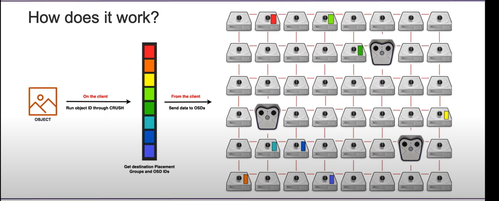
 - Khi các cluster chạm ngưỡng sau:
   - Nếu > 85% sẽ có cảnh báo đầy dữ liệu
   - Nếu > 90% sẽ biến cụm cluster trở thành Read-only cluster

Có thể thay đổi luật của CRUSH để thay đổi cách lưu object. 
- VD: 
```
ceph osd crush set-device-class <class> <osd-name> [...]
ceph osd crush rm-device-class <osd-name> [...]
```
- Sử dụng 2 lệnh trên để đặt tên lớp và xóa tên lớp của một hoặc nhiều osd.
- Tạo 1 luật mới bằng cách sau:
```
ceph osd crush rule create-replicated <rule-name> <root> <failure-domain-type> <class>
ceph osd pool set <pool-name> crush_rule <rule-name>
```
- Với
  - Name là tên của luật.
  - Root: node gốc của cụm muốn áp dụng luật, mặc định là default.
  - failure-domain-type: chỉ luật chia sẻ các placement group lên trên các osd: 
    - Nếu failure-domain-type = host: => Tất cả các PG phải nằm ở 1 host khác nhau
    - Nếu failure-domain-type = osd: => Tất cả các PG phải nằm ở 1 osd khác nhau
    - .....
  - Class: tên lớp của osd được áp dụng luật đó.

Xem các rule sẵn có bằng các lệnh:
``` 
ceph osd crush rule ls #liêt kê các tên rule
ceph osd crush rule dump #liên kê kỹ các rule
```
