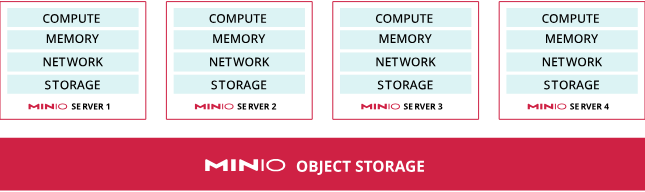

# MinIO

## I. Định nghĩa về MinIO
- MinIO là một giải pháp lưu trữ đối tượng, cung cấp API tương thích với Amazon Web Services S3 và hỗ trợ tất cả các tính năng cốt lõi của S3. MinIO được thiết kế để triển khai ở bất kỳ đâu - trên đám mây công cộng hoặc riêng, cơ sở hạ tầng baremetal, môi trường được quản lý và hạ tầng biên:

- MinIO lấy thiết kế gọn nhẹ và tính tương thích cao với s3api làm điểm mạnh của nó, nó có thể chạy trên nhiều môi trường khác nhau, từ máy chủ đơn đến cụm phân tán.

## II. Cấu trúc của 1 cụm MinIO: 
- MinIO sử dụng một loadbalancer, với mỗi minio server đều chứa đầy đủ thông tin về topology của cụm.
- Một cụm MinIO trong môi trường production thường gồm ít nhất 4 host (4 minio server), với tài nguyên lưu trữ và tính toán đồng nhất. 
- MinIO tổng hợp các tài nguyên này lại thành một pool và trình bày như một dịch vụ lưu trữ đối tượng duy nhất.

- MinIO có hỗ trợ các cấu trúc sau:
  - 1 Node, 1 Drive
  - 1 Node, nhiều Drive
  - Nhiều node, nhiều Drive 

- Đây đều là các môi trường phổ biến trong production và testing.
- Các cụm đều có thể kết nối với nhau thông qua site replication, tạo thành 1 cụm lớn:

- Tuy nhiên, khi kết nối như thế này, sẽ dễ gây ra độ trễ cao, nên cần cân nhắc trước khi kết nối.

## III. Tính HA của một cụm MinIO:

- MinIO sử dụng Erasure Coding ở cấp độ đối tượng theo cách phân tán và có thể tái tạo các đối tượng trong trường hợp xảy ra lỗi phần cứng mà không làm giảm hiệu suất hoặc gây ra thời gian ngừng hoạt động. EC phù hợp hơn với lưu trữ đối tượng so với RAID vì các đối tượng là các khối dữ liệu không thay đổi, được ghi một lần và đọc nhiều lần. MinIO sử dụng các lệnh Intel AVX512 để tận dụng tối đa tài nguyên CPU của máy chủ trên nhiều nút cho việc mã hóa xóa nhanh chóng.

- Không giống như CEPH sử dụng CRUSH MAP, MinIO tự động nhóm các drive để tạo thành 1 Erasure Set. Một Drive có thể được nhóm vào nhiều Erasure Set khác nhau. Các ES sẽ được phân bổ đồng đều lên trên các node trong pool để tạo sự an toàn. Sau đó, MinIO sẽ phân bố object thành các mảnh data và parity và phân bổ nó vào trong 1 ES.
- Minio hỗ trợ EC đến cấp 1.5, tức là giá trị lớn nhất của M = 0.5 K.
với EC:8, K=16 là cấp cao nhất, EC:4 là mặc định.

