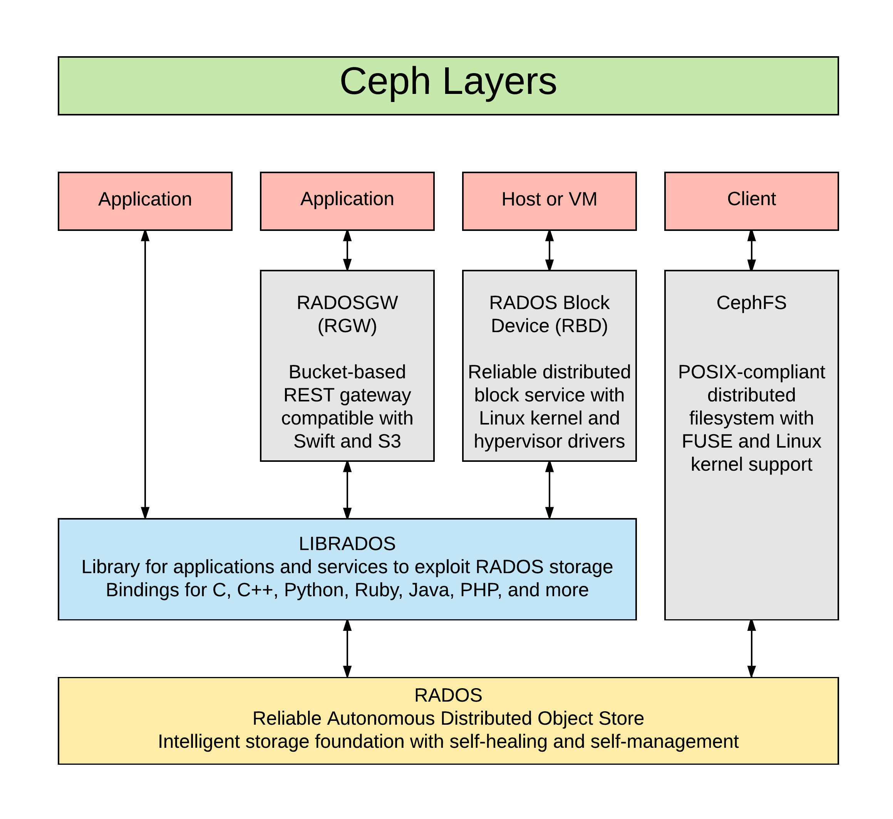
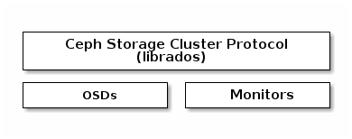
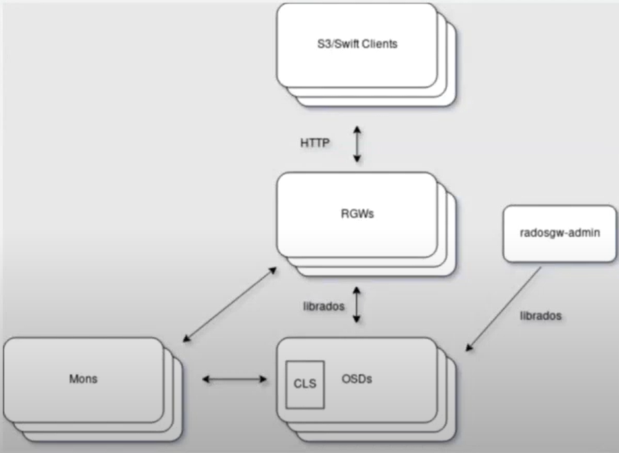
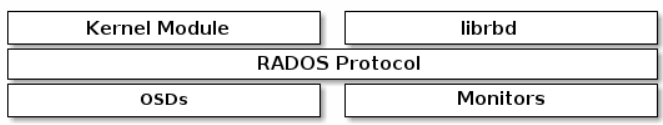

# RADOS Trong CEPH:

## I. RADOS
RADOS (Reliable Autonomic Distributed Object Store) là một thành phần cốt lõi của hệ thống lưu trữ Ceph. Đây là một hệ thống lưu trữ đối tượng phân tán, cung cấp nền tảng cho các dịch vụ lưu trữ khác của Ceph như RADOS Block Device (RBD), RADOS Gateway và Ceph File System.


RADOS cung cấp toàn bộ các tính năng của ceph, từ việc phân bố dữ liệu, versioning, tính tự quản lý, tự sửa lỗi, tính tin cậy cao,....

Rados chịu trách nhiệm cho việc quản lý dữ liệu, sao lưu dữ liệu, tạo các bản sao dữ liêu, luôn đảm bảo sao cho có nhiều hơn 1 bản copy của object trong cùng 1 cluster (Đối với cụm có replicated-count > 2).

Các phương thức truy xuất dữ liệu trong ceph (CephFS, RDB, RGW) đều hoạt động dựa trên RADOS.

Ceph lưu trữ các dữ liệu dưới dạng rados object, ta có thể cho 1 object vào trong ceph thông qua rados như sau:
```
rados -p <pool_name> put <object_name> <file_path>
rados -p <pool_name> ls
```
Sau đó, ta có thể xem được cấu trúc của 1 rados object như sau:
```
root@trunghieu-vdt4 ~# ceph osd map rep3_pool_rados object_hello_bk -f json-pretty

{
    "epoch": 64,
    "pool": "rep3_pool_rados",
    "pool_id": 7,
    "objname": "object_hello_bk",
    "raw_pgid": "7.8931001",
    "pgid": "7.1",
    "up": [
        2,
        1,
        0
    ],
    "up_primary": 2,
    "acting": [
        2,
        1,
        0
    ],
    "acting_primary": 2
}
```
- epoch: Đây là số phiên bản của cluster map tại thời điểm object này được tạo hoặc cập nhật. 
- pool: Tên của pool nơi object này được lưu trữ.  
- pool_id: ID duy nhất của pool trong cluster.
- objname: Tên của object.
- raw_pgid: ID của PG dưới dạng thô. là 7.8931001.
- pgid: ID của PG sau khi đã được ánh xạ. 
- up: Danh sách các OSD hiện đang hoạt động và chịu trách nhiệm lưu trữ object này.
- up_primary: ID của OSD chính trong danh sách up, chịu trách nhiệm chính cho object này. 
- acting: Danh sách các OSD hiện đang thực hiện các hoạt động liên quan đến object này. Danh sách này thường giống với danh sách up.
- acting_primary: ID của OSD chính trong danh sách acting, chịu trách nhiệm chính cho các hoạt động liên quan đến object này. ID này cũng sẽ thường giống với ID của up_primary.
## II. Librados:

Là một thư viện cho phép các ứng dụng có thể làm việc trực tiếp với RADOS. Librados cung cấp các API để tương tác trực tiếp với Ceph Monitor và Ceph OSD, nhằm lưu, xóa và quản lý dữ liệu hiệu quả.



Librados có hỗ trợ các ngôn ngữ: C, C++, Python, Java, PHP,...

# III. RADOS Gateway (radosgw):

Ceph Object Gateway, hay RADOS Gateway, là một cổng dịch vụ mạng chuyển các request HTTP thành các RADOS request và ngược lại, tương thích với Swift và S3 api, cung cấp giao diện Object Storage để lưu trữ dữ liệu dưới dạng object.

Nó cũng hỗ trợ các tính năng như IAM (Identity and Access Management), bucket, versioning, và các tính năng khác của object storage.

RadosGW được triển khai dưới dạng một mô-đun FastCGI sử dụng libfcgi và có thể được sử dụng cùng với bất kỳ máy chủ web nào hỗ trợ FastCGI.



Cấu tạo của 1 RGW Object như sau:


- Head: 
  - Chứa 1 RADOS Object.
  - Chứa toàn bộ metadata của RGW object.
- Tail: 
  - Chứa dải dữ liệu.
  - Có thể chứa từ 0 đến nhiều RADOS Object.

Bucket là đơn vị lưu trữ cơ bản trong radosgw, nơi các object được lưu trữ và quản lý.

Mỗi một request ở trong radosgw sẽ cần những thông tin sau để có thể truy cập vào các bucket, nhằm lưu trữ và sử dụng dữ liệu:
 - Thông tin về user S3, (key, secret)
 - Bucket entry info (Chứa thông tin cơ bản của bucket như tên, chủ sở hữu, ngày tạo,...)
 - Bucket instance info (Chứa các thông tin chi tiết hơn)


# IV RADOS BLOCK DEVICE (rdb):

Tương tự như radosgw, Ceph block devices hay (RADOS block devices) cung cấp giải pháp pháp block storage tới physical hypervisors, cung cấp cho các máy ảo (VMs). Ceph RBD driver được tích hợp với Linux mainline kernel và hỗ trợ QEMU/KVM.

Ceph cung cấp một mô-đun kernel cho RBD và một thư viện librados mà libvirt và KVM có thể liên kết. Đây thực chất là một thiết bị đĩa ảo phân phối "khối" của nó trên các OSD trong cụm Ceph. Một RBD cung cấp các khả năng sau:

- Tinh giản lưu trữ.
- Phân mảnh I/O và dễ dàng phục hồi trong cụm
- Có thể thay đổi kích thước
- Tạo snapshot nhanh và khôi phục
- Có thể sử dụng trực tiếp làm ổ đĩa của máy ảo KVM

RBD images là các thiết bị khối đơn giản được phân mảnh trên các đối tượng và lưu trữ trong một lưu trữ đối tượng RADOS. Kích thước của các object mà RBD images được phân mảnh tới phải là bội của 2

Điểm quan trọng của RBD là nó có thể được sử dụng làm ổ đĩa lưu trữ của máy ảo trong KVM. Do nó phân tán trên nhóm máy chủ OSD, máy ảo có thể được di chuyển nóng giữa các CPU trong cụm bằng cách tắt máy ảo ở CPU này và khởi động lại ở CPU khác, khiến người dùng không hề biết rằng các máy ảo vừa được di chuyển.


