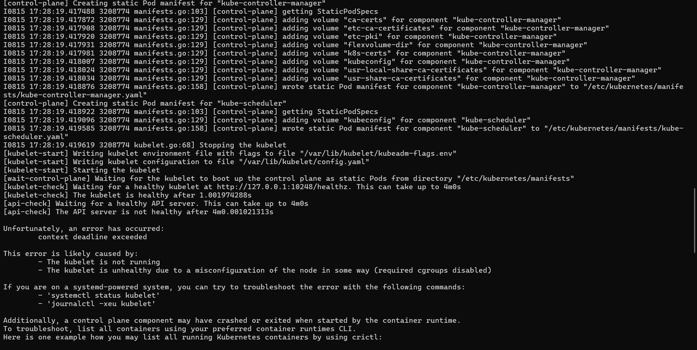

## A. Cài đặt 1 cụm k8s
### 1. Cài đặt các công cụ k8s:
```
apt update
apt install -y apt-transport-https ca-certificates curl

curl -fsSL https://pkgs.k8s.io/core:/stable:/v1.30/deb/Release.key | sudo gpg --dearmor -o /etc/apt/keyrings/kubernetes-apt-keyring.gpg

echo 'deb [signed-by=/etc/apt/keyrings/kubernetes-apt-keyring.gpg] https://pkgs.k8s.io/core:/stable:/v1.30/deb/ /' | sudo tee /etc/apt/sources.list.d/kubernetes.list

apt update

```


### 2. Cấu hình cho k8s sử dụng systemd thay cho cgroup
- Tắt swap space:
```
sudo swapoff -a
```
- Bật net.ipv4.ip_forward:
```
 echo "net.ipv4.ip_forward = 1" | sudo tee /etc/sysctl.d/k8s.conf   
```
- èw
```
sudo modprobe br_netfiller
sudo modprobe overlay
```
- Cấu hình containerd trong /etc/containerd/config.toml
```
    [plugins."io.containerd.grpc.v1.cri".containerd.runtimes.runc.options]
    ...
    SystemdCgroup = true
    ...

    [plugins."io.containerd.grpc.v1.cri"]
    ...
    systemd_cgroup = true
    ...
```
- Cấu hình file docker daemon.json:
```
{
    "bridge": "none",
    "ip-forward": false,
    "iptables": false,
    "exec-opts": ["native.cgroupdriver=systemd"],
    "log-opts": {
        "max-file": "5",
        "max-size": "50m"
    }
}
```
- Cấu hình kubelet trong file kubelet/config.yaml 
```
...
cgroupDriver: systemd
...
```
- Cho phép các port 6443 và 10250 thông qua firewall
```
sudo firewall-cmd --permanent --add-port=6443/tcp
sudo firewall-cmd --permanent --add-port=10250/tcp
sudo firewall-cmd --reload
```
- Restart lại service kubelet:
```
systemctl restart kubelet
```
- Xây thử 1 cụm k8s thông qua kubeadm:
```
kubeadm init --v=5
```
- Cài đặt cni packet:
```
curl -L -o cni-plugins-linux-amd64-v1.4.0.tgz https://github.com/containernetworking/plugins/releases/download/v1.4.0/cni-plugins-linux-amd64-v1.4.0.tgz
mkdir -p /opt/cni/bin
tar Cxzvf /opt/cni/bin cni-plugins-linux-amd64-v1.4.0.tgz

```
- Lỗi đang gặp phải:   

```

```