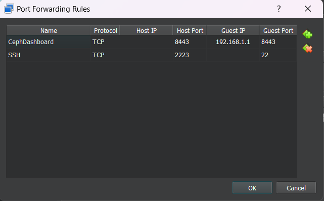

# Lab week 1, triển khai local 1 cụm ceph đơn giản bằng cephadm

## 1. Quy hoạch cụm ceph:

+ Node hieuserver (192.168.1.1) labels: _admin, rgw, mon, osd
+ Node ceph-osd-01 (192.168.1.21) labels: osd


## 2. Cài đặt:

- Cài đặt docker, openssh và ceph trên từng cụm máy (với máy hieuserver thì truy cập theo quyền root)

- Docker: 

```
sudo apt update
sudo apt install -y apt-transport-https ca-certificates curl software-properties-common

curl -fsSL https://download.docker.com/linux/ubuntu/gpg | sudo gpg --dearmor -o /usr/share/keyrings/docker-archive-keyring.gpg

echo "deb [arch=$(dpkg --print-architecture) signed-by=/usr/share/keyrings/docker-archive-keyring.gpg] https://download.docker.com/linux/ubuntu $(lsb_release -cs) stable" | sudo tee /etc/apt/sources.list.d/docker.list > /dev/null

sudo apt update
sudo apt install -y docker-ce

sudo systemctl start docker
sudo systemctl enable docker
```

- OpenSSH:

```
sudo apt install openssh-server
sudo systemclt enable ssh
```

- Cephadm:

```
apt update -y
apt install -y cephadm ceph-common

```
Bật PermitRootLogin cho các máy OSD trong /etc/ssh/sshd_config:
```
PermitRootLogin yes
```
## 3. Khởi tạo cluster:
- Deploy ceph trên hieuserver bằng root user:

```
cephadm bootstrap --mon-ip 192.168.1.1 --ssh-user root --cluster-network 192.168.1.0/24
```

Sau khi chạy xong, ta sẽ có thông tin của cluster và dashboard:
```
Ceph Dashboard is now available at:

             URL: https://hieuserver:8443/
            User: admin
        Password: **********

Enabling client.admin keyring and conf on hosts with "admin" label
```

Lưu lại password, forward cổng 8443 ra ngoài để truy cập vào dashboard  Dưới đây là ví dụ sử dụng oracleVM):



Truy cập vào dashboard và đổi password:

![alt text]..(/Picture/dashboard.png)
- Trước đó, cần xét iptables mở các cổng cần thiết cho các node monitor, osd, mgr,...
- Ceph monitor thường mặc định lấy các gói tin trên cổng 3300 và 6789
- Ceph OSD daemons thường sẽ kết nối bắt đầu từ cổng 6800, và kết nối đến giải cổng cuối là 7568. Mỗi lần kết nối trên 1 cổng không thành công, ceph OSD daemons sẽ tự động thử kết nối lên trên cổng tiếp theo.
- Thay đổi luật trong iptables của các node bằng lệnh sau:
```
# Đảm bảo các truy cập đầu vào của Ceph ports trên subnet
iptables -A INPUT -s 192.168.1.0/24 -p tcp -m state --state NEW -m multiport --dports 3300,6789,6800:7300,9283,8888,8889,18080,9100,9222 -j ACCEPT

# Đảm bảo các truy cập đầu ra của Ceph ports trên subnet
iptables -A OUTPUT -d 192.168.1.0/24 -p tcp -m state --state NEW -m multiport --dports 3300,6789,6800:7300,9283,8888,8889,18080,9100,9222 -j ACCEPT

# Cấp quyền kết nối SSH trên subnets
iptables -A INPUT -s 192.168.1.0/24 -p tcp -m state --state NEW --dport 22 -j ACCEPT
iptables -A OUTPUT -d 192.168.1.0/24 -p tcp -m state --state NEW --dport 22 -j ACCEPT

```
- Sau đó, sử dụng kết nối ssh để kết nối mon với các host:
- Thêm 2 node osd vào cụm bằng cách gửi ceph.pub qua các node và thêm host:
```
ssh-copy-id -f -i /etc/ceph/ceph.pub root@ceph-osd
ssh-copy-id -f -i /etc/ceph/ceph.pub root@ceph-osd-2 

scp /etc/ceph/ceph.conf root@ceph-osd:/etc/ceph/ceph.conf
scp /etc/ceph/ceph.conf root@ceph-osd-2:/etc/ceph/ceph.conf

ceph orch host add ceph-osd --labels osd
ceph orch host add ceph-osd-2 --labels osd
```
- Tạo file ceph.keyring trên node monitor rồi gửi file ceph.keyring đến các osd rồi kích hoạt:
```
#Trên node monitor:
ceph auth get-or-create-key client.bootstrap-osd mon 'allow profile bootstrap-osd' -i /var/lib/ceph/bootstrap-osd/ceph.keyring

#Gửi keyring cho các host:
scp /var/lib/ceph/bootstrap-osd/ceph.keyring root@ceph-osd-01:/var/lib/ceph/bootstrap-osd/

#Trên các node osd, kích hoạt keyring:
  ceph auth import -i /var/lib/ceph/bootstrap-osd/ceph.keyring

#Kiểm tra
ceph auth get client.bootstrap-osd
```
Hoặc chạy tự động bằng file osd_spec.yaml:
```
service_type: osd
service_id: osd_spec_hdd
placement:
  hosts:
    - hieuserver
    - ceph-osd-01
spec:
  data_devices: #Ổ chứa data
    rotational: 1 #Do là HDD nên có xoay
  db_devices: #Ổ chứa metadata
    rotational: 1 #Do là HDD nên có xoay
    size: '20G:' #Lấy tất cả các ổ kích thước lớn hơn 20
    limit: 1 #1 db_devices cho mỗi OSD
```

Chạy dry run để cho ra kết quả kiểm thử trước:
```
ceph orch apply -i osd_spec.yaml --dry-run
```

Trong truong hop no available, zap de remove

```
ceph orch device ls
ceph orch device zap  ceph-osd /dev/sdb --force
ceph orch device zap  ceph-osd-2 /dev/sdb --force
ceph orch device ls hostname=ceph-osd --refresh
ceph orch device ls hostname=ceph-osd-2 --refresh
ceph orch ls
ceph orch rm osd.osd_spec_default
```

Chạy lệnh sau để ngừng tự động deploy monitor:
```
ceph orch apply mon --unmanaged
```
Sau đó chạy lệnh
```
ceph orch apply mon --placement="hieuserver" 
``` 
Để gán monitor vào nút chính là hieuserver.
- Tương tự với manager:
```
ceph orch apply mgr --unmanaged
ceph orch apply mgr --placement="hieuserver"
```

Remove host bằng lệnh:

```
ceph orch host drain ceph-osd-01 #Ngừng các trình nền chạy trên host
ceph orch host rm ceph-osd-01 #Sau khi các trình nền đã ngừng
```
## 4. Tạo pool
### 4.1 Replicated pool:
- Đầu tiên, ta cần phải tạo 1 rule cho pool:
```
ceph osd crush rule create-replicated rep_hdd_osd default osd hdd
#Tạo 1 pool replicated, với failure-domain-type osd, root là default và áp dụng lên hdd
```
Sau đó, tạo 1 pool:
```
ceph osd pool create pool_1 8 8 rep_hdd_osd 3
# Pool_1 với pg_num là 8, theo luật rep_hdd_osd và replicated-count là 3
```
### 4.2 Erasure coding Pool
- Đầu tiên, ta cần phải tạo 1 EC profile:
```
ceph osd erasure-code-profile set ec_hdd_osd k=2 m=1 crush-failure-domain=osd crush-root=default
# Tạo 1 ec_profile với k=2, m=1 => ratio: 1.5, failure-domain là osd và crush-root=default
```
- Sau đó, tạo 1 pool:
```
ceph osd pool create ec_pool_1 8 8 erasure ec_hdd_osd
```

### 4.3 Xóa pool
```
ceph config set mon mon_allow_pool_delete true
ceph osd pool delete <pool-name> <pool-name> --yes-i-really-really-mean-it
ceph config set mon mon_allow_pool_delete false
```

### 4.4 Kiểm tra các PG bị lỗi:
- Lấy ra các PG bị lỗi:
```
ceph pg dump | grep -E "undersized|inactive"     
```
- Kiểm tra đầy đủ thông tin của PG lỗi:
```
ceph pg <PG_ID> query
ceph pg repair <PG ID>
```

### 4.5 Liệt kê các pool:
- Sử dụng 
```
ceph osd lspools
```
### 5 RADOS

- Cách thêm object vào 1 pool thông qua rados:
```
rados -p rep3_pool_rados put object_1 hello.txt
```

- Kiểm tra object có trong pool:
```
ceph osd map rep3_pool_rados object_1 -f json-pretty
```
