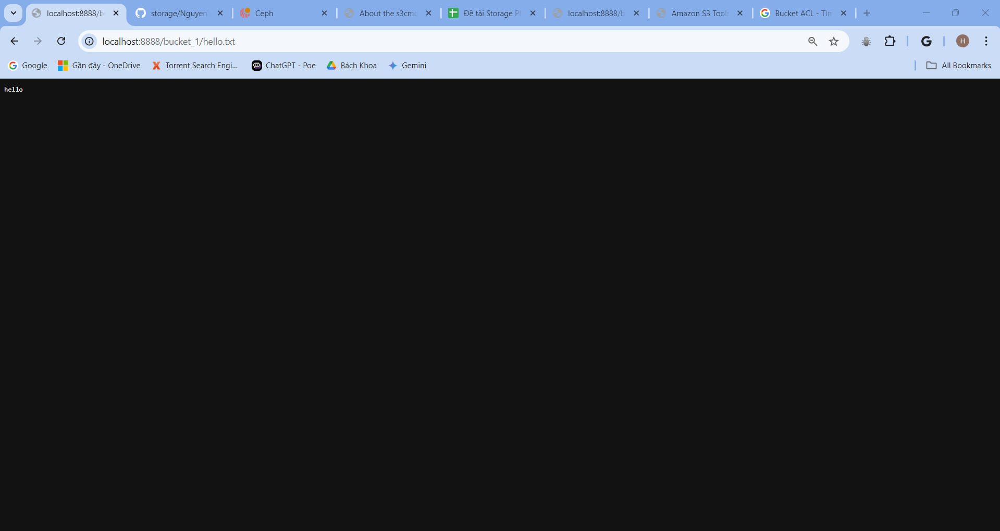
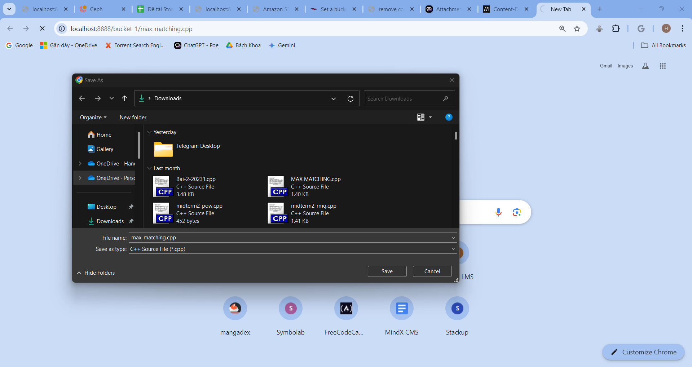

# Lab week 2, cài đặt Radosgw và rdb lên trên cụm ceph

# A. RADOSGW:

## 1. Thêm label và service rgw cho host:
```
ceph orch host label add trunghieu-vdt4 rgw
ceph orch apply rgw rgw_public '--placement=label:rgw count-per-host:1' --port=8888
ceph orch apply rgw rgw_private '--placement=label:rgw count-per-host:1' --port=8889
```
Sau khi chạy xong, kiểm tra kết quả service thông qua ceph orch ls:
```
root@trunghieu-vdt4 ~# ceph orch ls
NAME                  PORTS   RUNNING  REFRESHED  AGE  PLACEMENT
crash                             1/1  3s ago     2d   *
mgr                               1/2  3s ago     2d   count:2
mon                               1/5  3s ago     2d   count:5
osd.osd_spec_default                3  3s ago     2d   trunghieu-vdt4
rgw.rgw_private       ?:8889      1/1  3s ago     9s   count-per-host:1;label:rgw
rgw.rgw_public        ?:8888      1/1  3s ago     32s  count-per-host:1;label:rgw
```
Kiểm tra pool rgw.root được tạo:
```
root@trunghieu-vdt4 ~ [22]# ceph osd lspools
1 .mgr
7 rep3_pool_rados
8 ec_pool_rados
9 .rgw.root
```

## 2. Tạo 1 rgw user:

- Trước hết, cần tạo các pool sau để radosgw có thể chạy:
  - .rgw.log # Chứa log của radosgw
  - .rgw.control #Chứa các hoạt động kiểm soát nội bộ
  - .rgw.meta #Chứa các metadata cho các đối tượng quản lý rgw
  - .rgw.buckets.index #Chứa các index của các bucket
  - .rgw.buckets.data #Chứa dữ liệu của rgw
  - .rgw.buckets.non-ec #Chứa dữ liệu ec.
- Tạo pool bằng lệnh sau:
```
ceph osd pool create .rgw.root 32 32 rep_hdd_osd 3
ceph osd pool application enable .rgw.root rgw
ceph osd pool create default.rgw.log 32 32 rep_hdd_osd 3
ceph osd pool application enable default.rgw.log rgw
ceph osd pool create default.rgw.control 32 32 rep_hdd_osd 3
ceph osd pool application enable default.rgw.control rgw
ceph osd pool create default.rgw.meta 8 8 rep_hdd_osd 3
ceph osd pool application enable default.rgw.meta rgw
ceph osd pool create default.rgw.buckets.index 8 8 rep_hdd_osd 3
ceph osd pool application enable default.rgw.buckets.index rgw
ceph osd pool create default.rgw.buckets.data 64 64 rep_hdd_osd 3
ceph osd pool application enable default.rgw.buckets.data rgw
ceph osd pool create default.rgw.buckets.non-ec 32 32 rep_hdd_osd 3
ceph osd pool application enable default.rgw.buckets.non-ec rgw
```
- Sau đó, tạo thử một user mới để có thể thêm thông tin vào các s3api:
```
radosgw-admin user create --uid=admin --display-name=admin  --system
```
- Sau khi tạo xong, ta sẽ có 1 admin user như sau:
```
{
    "user_id": "admin",
    "display_name": "admin",
    "email": "",
    "suspended": 0,
    "max_buckets": 1000,
    "subusers": [],
    "keys": [
        {
            "user": "admin",
            "access_key": ACCESS_KEY_ADMIN,
            "secret_key": SECRET_KEY_ADMIN
        }
    ],
    "swift_keys": [],
    "caps": [],
    "op_mask": "read, write, delete",
    "system": "true",
    "default_placement": "",
    "default_storage_class": "",
    "placement_tags": [],
    "bucket_quota": {
        "enabled": false,
        "check_on_raw": false,
        "max_size": -1,
        "max_size_kb": 0,
        "max_objects": -1
    },
    "user_quota": {
        "enabled": false,
        "check_on_raw": false,
        "max_size": -1,
        "max_size_kb": 0,
        "max_objects": -1
    },
    "temp_url_keys": [],
    "type": "rgw",
    "mfa_ids": []
}
``` 
## 3. Sử dụng S3api với s3cmd:
- s3cmd là một công cụ dòng lệnh được sử dụng để quản lý và truy cập vào dịch vụ lưu trữ đám mây Amazon S3 (Simple Storage Service). Lab này sẽ sử dụng s3cmd để tạo bucket lên trên cụm:
- Tải s3cmd:
```
sudo apt-get update
sudo apt-get install s3cmd
```
- Sau đó, cài đặt cấu hình cho s3cmd thông qua lệnh `s3cmd --configure`  hoặc ` (nano/vim) /root/.s3cfg` để sửa thẳng:
```
  Access Key: ACCESS_KEY_ADMIN
  Secret Key: SECRET_KEY_ADMIN
  Default Region: US
  S3 Endpoint: MON_IP:8888
  DNS-style bucket+hostname:port template for accessing a bucket: MON_IP:8888
  Encryption password: <New-password>
  Path to GPG program: /usr/bin/gpg
  Use HTTPS protocol: False
  HTTP Proxy server name:
  HTTP Proxy server port: 0
```
- Kiểm tra cấu hình s3cmd:
```
Test access with supplied credentials? [Y/n]
Please wait, attempting to list all buckets...
Success. Your access key and secret key worked fine :-)

Now verifying that encryption works...
Success. Encryption and decryption worked fine :-)
```
## 4. Tạo 1 bucket và thêm object vào 1 bucket:
- Tạo 1 bucket mới thông qua s3cmd:
```
s3cmd mb s3://<bucket-name>
```
- Thêm 1 object mới vào 1 bucket thông qua lệnh:
```
s3cmd put <file-path> s3://<bucket-name>
```
- Kiểm tra object đó đã nằm trong bucket chưa thông qua lệnh:
```
s3cmd ls s3://<bucket-name>
```
- Sử dụng radosgw-admin để kiểm tra xem bucket đã nằm trong cluster hay chưa:
```
radosgw-admin bucket list         
```

## 5. Xóa 1 bucket/object:
- Để xóa 1 object ta cần lệnh sau:
```
s3cmd del s3://firstbucket/hello.txt
```
- Hoặc xóa 1 bucket, ta cần lệnh sau:
```
s3cmd rb s3://firstbucket --force
```
## 6. Tải file từ 1 bucket:
### 6.1 Tải file public:
- Ta cần phải set Access Control List của một object thành public thông qua lệnh:
```
s3cmd setacl s3://bucket_1/hello.txt --acl-public
```
- Sau đó, ta mới có thể truy cập được file thông qua đường link: `http://MON_IP:8888/bucket_1/hello.txt` hoặc sử dụng curl:
- Kết quả khi truy cập file trên browser:


- Kết quả khi sử dụng curl: 
```
root@trunghieu-vdt4 ~# rm hello.txt
root@trunghieu-vdt4 ~# curl -O http://<MON_IP>:8888/bucket_1/hello.txt
  % Total    % Received % Xferd  Average Speed   Time    Time     Time  Current
                                 Dload  Upload   Total   Spent    Left  Speed
100     6  100     6    0     0   2074      0 --:--:-- --:--:-- --:--:--  3000
root@trunghieu-vdt4 ~# cat hello.txt
hello
```
- Ngoài ra, ta có thể thêm `Content-Disposition: attachment` (Tài liệu về Content-Disposition tại [đây](https://developer.mozilla.org/en-US/docs/Web/HTTP/Headers/Content-Disposition)) vào trong phần header của file để có thể tự động tải xuống khi truy cập vào đường link:
```
s3cmd modify s3://bucket_1/max_matching.cpp --add-header='Content-Disposition: attachment'
```
- Sau đó, kiểm tra header sử dụng curl:
```
root@trunghieu-vdt4 ~# curl -I http://171.254.94.63:8888/bucket_1/max_matching.cpp

HTTP/1.1 200 OK
Content-Length: 910
Accept-Ranges: bytes
Last-Modified: Tue, 13 Aug 2024 04:07:28 GMT
x-rgw-object-type: Normal
ETag: "136c028bb5ba52780f2f91e29c19be81"
x-amz-meta-s3cmd-attrs: atime:1723520310/ctime:1723520291/gid:0/gname:root/md5:136c028bb5ba52780f2f91e29c19be81/mode:33188/mtime:1723520291/uid:0/uname:root
Content-Disposition: attachment
X-Amz-Storage-Class: STANDARD
x-amz-request-id: tx00000a05902bae622eb12-0066badc24-3ac1-default
Content-Type: text/x-c++
Date: Tue, 13 Aug 2024 04:08:04 GMT
Connection: Keep-Alive
```
- Kết quả sau khi truy cập vào đường link


### 6.2 Sử dụng signurl đối với các file muốn để private:
- Ta cần phải tạo 1 signurl để có thể tải 1 file từ bucket private như sau:
```
s3cmd signurl s3://<bucket-name>/<file-name> <expiry-time>
#VD:
set expiry_time (date -d 'now + 1 hour' +%s)
s3cmd signurl s3://bucket_1/hello.txt $expiry_time
...
http://171.254.94.63:8888/bucket_1/hello_from_bucket_1.txt?AWSAccessKeyId=ZXH2R0LVXVS37RNSXSLC&Expires=1723522000&Signature=FJUf%2Fi7O6KoCnPsP79GUD%2FLU4d8%3D
```
- Đường link trên có hạn sử dụng, ta chỉ cần paste vào trong browser hoặc sử dụng curl như sau:
```
curl -O http://171.254.94.63:8888/bucket_1/hello_from_bucket_1.txt?AWSAccessKeyId=ZXH2R0LVXVS37RNSXSLC&Expires=1723522000&Signature=FJUf%2Fi7O6KoCnPsP79GUD%2FLU4d8%3D
```
- Kết quả khi truy cập trong browser:


## 7. Set policy cho bucket thông qua file json:
- Ta có thể tạo 1 policy cho 1 bucket như sau:
```
(nano/vim) public_read_policy_bucket3.json

{
  "Version": "2012-10-17",
  "Statement": [
    {
      "Effect": "Allow",
      "Principal": "*",
      "Action": "s3:GetObject",
      "Resource": "arn:aws:s3:::bucket_3/*"
    }
  ]
}
```
- Ý nghĩa của các trường:
  - Effect: Allow/Denied - cấp quyền/tước quyền cho các hành động trong policy.
  - Principal - Chỉ các đối tượng mà các policy áp dụng lên.
  - Action - Chỉ các hành động mà đối tượng được quyền làm.
  - Resource - Chỉ tới khu vực mà policy có thể áp dụng tới
- Với ví dụ trên, policy có nghĩa là "Cấp quyền cho mọi người dùng có thể lấy dữ liệu trong bucket_3"
- Áp dụng 1 policy vào 1 bucket thông qua lệnh:
```
s3cmd setpolicy <policy-name> s3://<bucket-name>
```

## 8. Chia "folder" trong 1 bucket:
-  Amazon S3 không có một cấu trúc folder truyền thống, nó sử dụng 1 miền tên phẳng, nên sẽ không có 1 cấu trúc cây như trong , tuy nhiên, ta có thể "giả lập" một "folder" trong bucket thông qua cờ `--recursive`
- Đầu tiên, để tạo 1 "folder"/ thêm 1 object vào folder, ta có thể sử dụng cùng 1 lệnh với lúc ta thêm file vào bucket:
```
s3cmd put hello_bk.txt s3://bucket_3/folder_1/

upload: 'hello_bk.txt' -> 's3://bucket_3/folder_1/hello_bk.txt'  [1 of 1]
```
- Hoặc thậm chí là 1 subfolder:
```
s3cmd put hello_bk.txt s3://bucket_3/folder_1/sub_folder_1/

upload: 'hello_bk.txt' -> 's3://bucket_3/folder_1/sub_folder_1/hello_bk.txt'  [1 of 1]
```
- Ta vẫn có thể truy cập được vào file, bây giờ chỉ cần thêm folder và sub folder trước tên file như `http://171.254.94.63:8888/bucket_3/folder_1/sub_folder_1/hello_bk.txt

- Ta có thể xem đầy đủ cấu trúc của folder trong bucket thông qua lệnh
```
s3cmd ls s3://bucket_3/ --recursive


2024-08-13 07:10            8  s3://bucket_3/folder_1/sub_folder_1/hello_bk.txt
2024-08-13 07:13            6  s3://bucket_3/folder_2/hello.txt
2024-08-13 07:11            8  s3://bucket_3/folder_2/hello_bk.txt
2024-08-13 04:20            6  s3://bucket_3/hello.txt
```
- Và để xóa 1 folder/sub_folder, ta chỉ cần thêm cờ `--recursive`:

```
s3cmd del s3://bucket_3/folder_2/ --recursive

delete: 's3://bucket_3/folder_2/hello.txt'
delete: 's3://bucket_3/folder_2/hello_bk.txt'
```

## 9. Realm, Zone, Zonegroup:
- Realm, zone và zonegroup là các khái niệm quan trọng trong việc setup một cụm multi-site - cấu hình cho phép quản lý và đồng bộ hóa dữ liệu giữa nhiều cụm Ceph khác nhau.
- Một realm chứa các cài đặt và quản lý các zonegroup. Để tạo 1 realm, ta cần nhập lệnh như sau:
```
radosgw-admin realm create --rgw-realm=vdtcloud --default
{
    "id": "3d577d32-fccf-4951-b59b-22154f4dfddd",
    "name": "vdtcloud",
    "current_period": "e14d3a02-2c31-4f05-ac9a-8a372adfd715",
    "epoch": 1
}
```
- Một zonegroup sẽ là một tập hợp các zone trong Ceph. Các zone trong cùng một zonegroup có thể chia sẻ cùng một tập các pools và user. Các bucket khi được tạo sẽ được sở hữu bởi 1 zonegroup, và object data của các bucket đó chỉ có thể lưu trữ các bản copy sang các zone khác trong cùng 1 zone group:
- Để tạo 1 zonegroup, ta sử dụng lệnh:
```
radosgw-admin radosgw-admin zonegroup create --rgw-zonegroup=zonegroup_1 --rgw-realm=vdtcloud --endpoints=http://<RADOSGW-IP>:8888 
```
<em>Lưu ý, nếu realm chỉ có 1 zonegroup, ta sẽ thêm cờ `--default` vào đây để mặc định đây sẽ là zonegroup chính của realm, và các zone mới được tạo sẽ mặc định nằm trong zonegroup này.</em>
- Kết quả sau khi chạy lệnh trên:
```
{
    "id": "5e77664a-5cc2-4e86-b0b6-e27b30d5209d",
    "name": "zonegroup_1",
    "api_name": "zonegroup_1",
    "is_master": "false",
    "endpoints": [
        "http://<RADOSGW-IP>:8888"
    ],
    "hostnames": [],
    "hostnames_s3website": [],
    "master_zone": "",
    "zones": [],
    "placement_targets": [],
    "default_placement": "",
    "realm_id": "3d577d32-fccf-4951-b59b-22154f4dfddd",
    "sync_policy": {
        "groups": []
    }
}
```
- Tạo 1 master zone (zone chính, nơi các resources chính của ứng dụng/dịch vụ được triển khai) mới lên trên cụm ceph thông qua lệnh:
```
radosgw-admin zone create --rgw-zonegroup=zonegroup_1 \
                            --rgw-zone=master_zone \
                            --master --default \
                            --endpoints=S3_ENDPOINT
```
<em>Lưu ý, Masterzone có thể tạo mà không cần thêm `--access-key` và `--secret-key` trong user, vì những zone này được quản lý bởi quản trị viên, không nên tương tác với zone này thông qua s3api để tăng tính bảo mật</em>
- Kết quả sau khi tạo xong:
```
{
    "id": "d6109c76-ff47-4fdf-b4fd-e9d1cfbb2d52",
    "name": "master_zone",
    "domain_root": "master_zone.rgw.meta:root",
    "control_pool": "master_zone.rgw.control",
    "gc_pool": "master_zone.rgw.log:gc",
    "lc_pool": "master_zone.rgw.log:lc",
    "log_pool": "master_zone.rgw.log",
    "intent_log_pool": "master_zone.rgw.log:intent",
    "usage_log_pool": "master_zone.rgw.log:usage",
    "roles_pool": "master_zone.rgw.meta:roles",
    "reshard_pool": "master_zone.rgw.log:reshard",
    "user_keys_pool": "master_zone.rgw.meta:users.keys",
    "user_email_pool": "master_zone.rgw.meta:users.email",
    "user_swift_pool": "master_zone.rgw.meta:users.swift",
    "user_uid_pool": "master_zone.rgw.meta:users.uid",
    "otp_pool": "master_zone.rgw.otp",
    "system_key": {
        "access_key": "",
        "secret_key": ""
    },
    "placement_pools": [
        {
            "key": "default-placement",
            "val": {
                "index_pool": "master_zone.rgw.buckets.index",
                "storage_classes": {
                    "STANDARD": {
                        "data_pool": "master_zone.rgw.buckets.data"
                    }
                },
                "data_extra_pool": "master_zone.rgw.buckets.non-ec",
                "index_type": 0,
                "inline_data": "true"
            }
        }
    ],
    "realm_id": "3d577d32-fccf-4951-b59b-22154f4dfddd",
    "notif_pool": "master_zone.rgw.log:notif"
}
```

## 10. Storage class:
```
radosgw-admin zonegroup placement add --rgw-zonegroup default --placement-id default-placement --storage-class SLIVER

radosgw-admin zone placement add --rgw-zone=vdtzone --rgw-zonegroup=default\
--placement-id=default-placement --storage-class=SLIVER \
--data-pool=default.rgw.sliver.data

radosgw-admin zone modify --rgw-realm=vdtcloud --rgw-zonegroup=default --rgw-zone=default --access-key=ZXH2R0LVXVS37RN
SXSLC --secret-key uOEelPb0fANMkt0YWpaWCQd7zBCFOmz1t420pRQL --master --default

[
    {
        "key": "default-placement",
        "val": {
            "name": "default-placement",
            "tags": [],
            "storage_classes": [
                "SLIVER",
                "STANDARD"
            ]
        }
    }
]


{
    "id": "49043ec9-0d2c-4054-bc08-e7be3dd94099",
    "name": "default",
    "domain_root": "default.rgw.meta:root",
    "control_pool": "default.rgw.control",
    "gc_pool": "default.rgw.log:gc",
    "lc_pool": "default.rgw.log:lc",
    "log_pool": "default.rgw.log",
    "intent_log_pool": "default.rgw.log:intent",
    "usage_log_pool": "default.rgw.log:usage",
    "roles_pool": "default.rgw.meta:roles",
    "reshard_pool": "default.rgw.log:reshard",
    "user_keys_pool": "default.rgw.meta:users.keys",
    "user_email_pool": "default.rgw.meta:users.email",
    "user_swift_pool": "default.rgw.meta:users.swift",
    "user_uid_pool": "default.rgw.meta:users.uid",
    "otp_pool": "default.rgw.otp",
    "system_key": {
        "access_key": "",
        "secret_key": ""
    },
    "placement_pools": [
        {
            "key": "default-placement",
            "val": {
                "index_pool": "default.rgw.buckets.index",
                "storage_classes": {
                    "SLIVER": {
                        "data_pool": "default.rgw.sliver.data"
                    },
                    "STANDARD": {
                        "data_pool": "default.rgw.buckets.data"
                    }
                },
                "data_extra_pool": "default.rgw.buckets.non-ec",
                "index_type": 0,
                "inline_data": "true"
            }
        }
    ],
    "realm_id": "",
    "notif_pool": "default.rgw.log:notif"
}
```
- Kiểm tra service storage class thông qua ceph df:
```

ceph df

```
## 11. Encryption

- Ceph Object Gateway hỗ trợ mã hóa phía server thông qua 3 lựa chọn. Các object khi được gửi qua HTTP dưới dạng raw, sẽ được lưu trữ trong Bucket dưới dạng mã hóa.

- Ceph sử dụng [Hashicorp Vault](https://developer.hashicorp.com/vault/docs) làm dịch vụ quản lý key, tạo và mã hóa data theo trình tự như sau:


## 12. Shadow object:
- _shadow trên các đối tượng trong bể chứa SLIVER cho biết đây là các shadow object.
Các shadow object được tạo trong các lớp lưu trữ không phải mặc định và đóng vai trò là các mục nhập tham chiếu đến các đối tượng thực sự được lưu trữ trong bể chứa mặc định. 

Khi lưu trữ một object với một storage class trữ tùy chỉnh như SLIVER, RGW sẽ tạo ra object chính trong bể chứa mặc định và một shadow object trong bể chứa SLIVER. Điều này cho phép RGW quản lý đối tượng trên các lớp lưu trữ khác nhau và đảm bảo tính nhất quán của dữ liệu.

Khi xóa một object, RGW thường xóa đối tượng chính khỏi bể chứa mặc định và shadow object tương ứng khỏi bể chứa lớp lưu trữ tùy chỉnh. 

# B. RDB:

## 1. Thêm label và service rdb cho host và pool:
- Thêm label rdb:
```
ceph orch host label add trunghieu-vdt4 rdb
```
- Enable application rdb cho các pool:
```
ceph osd pool application enable <pool-name> rbd
```
## 2. Tạo images RDB:
Tạo 1 rbd images bằng lệnh sau:
```
rbd create rep3_pool_rados/boot_image_1 --size 10240
```
- Hoặc, tạo 1 snapshot bằng lệnh sau:
```
rbd snap create <pool-name>/<image-name>@<snapshot-name>
```
- Sau đó map RBD image mới tạo lên 1 block_device ở host:
```
rbd map rep3_pool_rados/boot_image_1
#Kết quả trả vể:
/dev/rbd0
```
- Kiểm tra block thông qua lsblk:
```
lsblk
NAME                                                                                                  MAJ:MIN RM   SIZE RO TYPE MOUNTPOINTS
loop0                                                                                                   7:0    0  63.9M  1 loop /snap/core20/2318
loop1                                                                                                   7:1    0  63.5M  1 loop /snap/core20/1891
loop2                                                                                                   7:2    0 111.9M  1 loop /snap/lxd/24322
loop3                                                                                                   7:3    0    87M  1 loop /snap/lxd/29351
loop4                                                                                                   7:4    0  53.2M  1 loop /snap/snapd/19122
loop4                                                                                                   7:4    0  53.2M  1 loop /snap/snapd/19122
loop5                                                                                                   7:5    0  38.8M  1 loop /snap/snapd/21759
rbd0                                                                                                  251:0    0    10G  0 disk
vda                                                                                                   252:0    0    60G  0 disk
└─vda1                                                                                                252:1    0    60G  0 part /
vdb                                                                                                   252:16   0    60G  0 disk
├─ceph--f372c02f--780f--40ef--b5b0--a0744ea6a793-osd--block--e1f0f69f--3905--49dd--a580--55e3766dab1a 253:0    0    20G  0 lvm
├─ceph--f372c02f--780f--40ef--b5b0--a0744ea6a793-osd--block--c01f11a8--bad2--421a--a58b--80a52790c8bc 253:1    0    20G  0 lvm
└─ceph--f372c02f--780f--40ef--b5b0--a0744ea6a793-osd--block--400d3a62--2724--40f2--9067--06873ed4a96b 253:2    0    20G  0 lvm
```
- format block mới tạo với một bootable filesystem để có thể sử dụng nó như 1 bootvolume, sử dụng mkfs.ext4
```
mkfs.ext4 /dev/rbd0


mke2fs 1.46.5 (30-Dec-2021)
Discarding device blocks: done
Creating filesystem with 2621440 4k blocks and 655360 inodes
Filesystem UUID: 6151a612-4b48-4086-83b9-4142966db59b
Superblock backups stored on blocks:
        32768, 98304, 163840, 229376, 294912, 819200, 884736, 1605632

Allocating group tables: done
Writing inode tables: done
Creating journal (16384 blocks): done
Writing superblocks and filesystem accounting information: done

```

## 3. Tạo máy ảo:

```
 cp /root/CentOS_7_7_final /mnt/boot_image_CentOS_1.qcow2

 virt-install \
  --name=myvm \
  --ram=2048 \
  --vcpus=2 \
  --disk path=/dev/rbd0,format=qcow2 \
  --os-variant=centos7.0 \
  --network network=default \
  --graphics none \
  --console pty,target_type=serial
``` 

```
virsh destroy myvm  
virsh undefine myvm
```