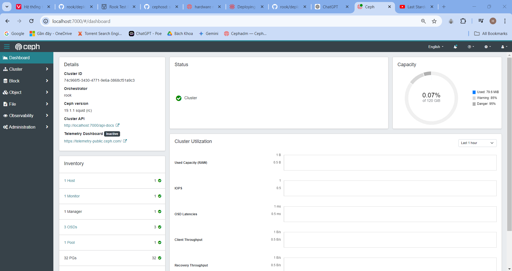
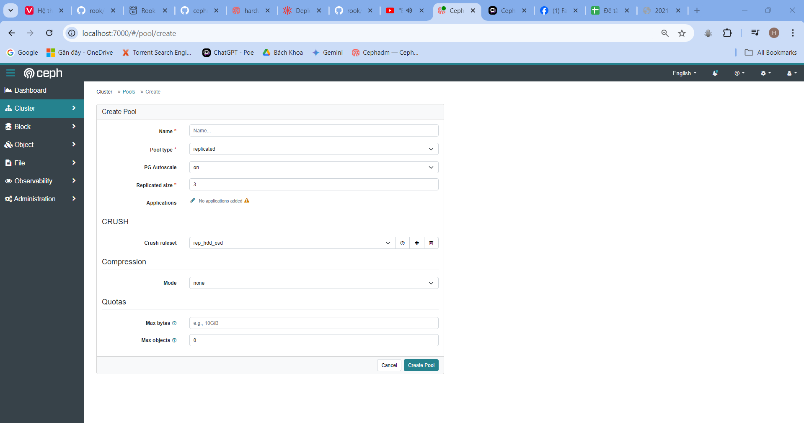
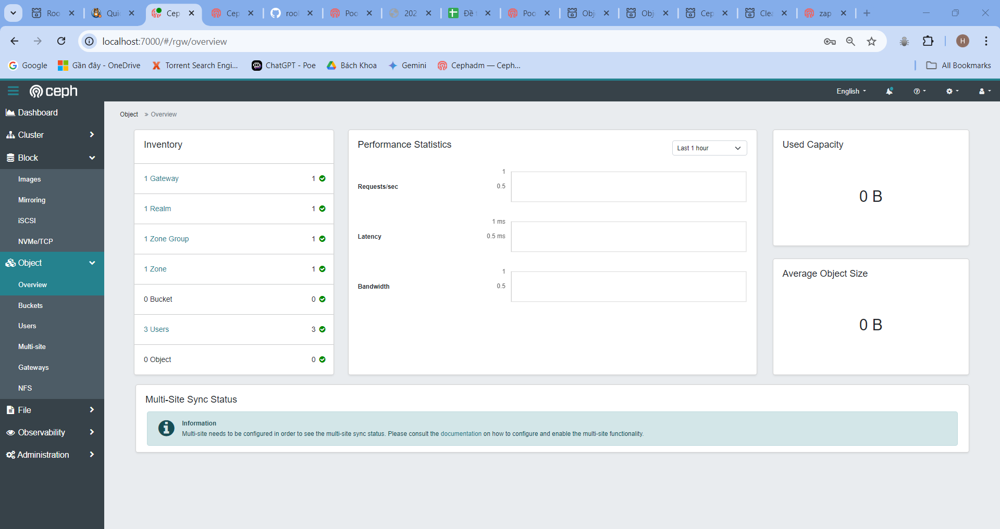
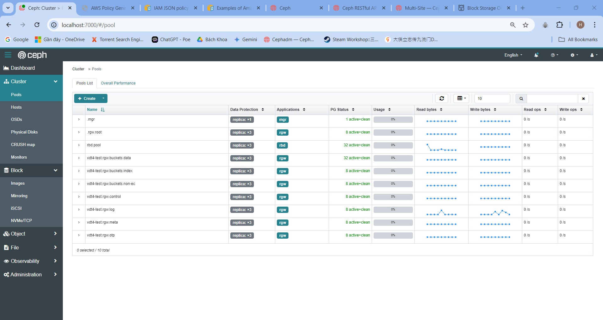
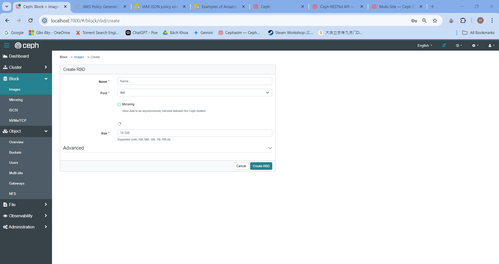
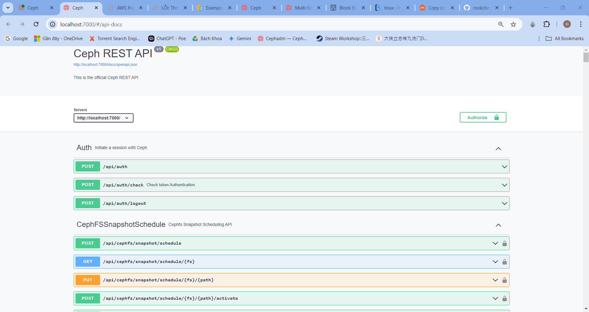

# Lab week 3, deploy Ceph ROOK trên VM.

## 1. Quy hoạch:

- Một cụm k8s gồm 1 node.
- Cụm k8s được cài CNI network sử dụng Calico thông qua [document sau](https://docs.tigera.io/calico/latest/getting-started/kubernetes/quickstart)


## 2. Cài đặt rook-ceph
- Tải các file manifest cần thiết:
```
git clone --single-branch --branch v1.14.9 https://github.com/rook/rook.git
cd rook/deploy/examples
```
- Apply các file manifest để tạo pod ceph-operator
```
kubectl create -f crds.yaml -f common.yaml -f operator.yaml
```
- Kiểm tra pod chạy thông qua:
```
kubectl -n rook-ceph get pod
NAME                                            READY   STATUS      RESTARTS        AGE
rook-ceph-operator-7d5565fbc7-25m4x             1/1     Running     0               1m23s
```
- Sau đó, dựng 1 cụm ceph-rook thông qua file .yaml, do hiện tại mới chỉ có 1 nodes, ta sẽ sử dụng một file .yaml custom tên là `cluster-test-osd3.yaml`
```
apiVersion: ceph.rook.io/v1
kind: CephCluster
metadata:
  name: my-cluster
  namespace: rook-ceph # namespace:cluster
spec:
  dataDirHostPath: /var/lib/rook
  cephVersion:
    image: quay.io/ceph/ceph:v19
    allowUnsupported: true
  mon:
    count: 1
    allowMultiplePerNode: true
  mgr:
    count: 1
    allowMultiplePerNode: true
    modules:
      - name: rook
        enabled: true
  dashboard:
    enabled: true
  crashCollector:
    disable: true
  storage:
    useAllNodes: true
    useAllDevices: true
    config:
      osdsPerDevice: "3"
    allowDeviceClassUpdate: true
    allowOsdCrushWeightUpdate: false
  monitoring:
    enabled: false
  healthCheck:
    daemonHealth:
      mon:
        interval: 45s
        timeout: 600s
  priorityClassNames:
    all: system-node-critical
    mgr: system-cluster-critical
  disruptionManagement:
    managePodBudgets: true
  cephConfig:
    global:
      osd_pool_default_size: "1"
      mon_warn_on_pool_no_redundancy: "false"
      bdev_flock_retry: "20"
      bluefs_buffered_io: "false"
      mon_data_avail_warn: "10"
---
apiVersion: ceph.rook.io/v1
kind: CephBlockPool
metadata:
  name: builtin-mgr
  namespace: rook-ceph
spec:
  name: .mgr
  replicated:
    size: 1
    requireSafeReplicaSize: false
```
- Sau đó dựng 1 cụm cluster thông qua `kubectl create` và chờ đến khi tất cả các pod đều ở trạng thái `running`:
```
root@trunghieu-vdt4 ~# kubectl -n rook-ceph get pods
NAME                                                 READY   STATUS      RESTARTS   AGE
csi-cephfsplugin-provisioner-f7b6884cd-k5fdk         5/5     Running     0          88m
csi-cephfsplugin-zvwdn                               2/2     Running     0          88m
csi-rbdplugin-provisioner-6ffb58d598-zqb7n           5/5     Running     0          88m
csi-rbdplugin-rwmmp                                  2/2     Running     0          88m
rook-ceph-exporter-trunghieu-vdt4-7d678ccdc9-6vm4k   1/1     Running     0          86m
rook-ceph-mgr-a-7968f7c7b9-txfpf                     1/1     Running     0          87m
rook-ceph-mon-a-5d9fc69f8f-d9tbp                     1/1     Running     0          88m
rook-ceph-operator-b798d7d74-brd85                   1/1     Running     0          92m
rook-ceph-osd-0-7f98dc4bd9-ftwwd                     1/1     Running     0          86m
rook-ceph-osd-1-685f44446c-l5x65                     1/1     Running     0          86m
rook-ceph-osd-2-fcd98d8d7-psh8p                      1/1     Running     0          86m
rook-ceph-osd-prepare-trunghieu-vdt4-5vjkh           0/1     Completed   0          87m
```
- Cài đặt `toolbox.yaml` để có thể tương tác với cụm ceph thông qua toolbox:
```
kubectl apply -f toolbox.yaml
kubectl -n rook-ceph get pods
NAME                                                 READY   STATUS      RESTARTS   AGE
...
rook-ceph-tools-767b99dbdd-sd57c                     1/1     Running     0          62m
```
- Sau khi tạo xong một cụm cluster và cài toolbox, ta có thể kiểm tra tình trạng của cụm ceph như sau:

```
root@trunghieu-vdt4 ~# kubectl -n rook-ceph exec -it <rook-ceph-tools-name> -- /bin/bash
bash-5.1$ ceph -s
  cluster:
    id:     74c966f5-3430-4771-9e6a-3868cf51a9c3
    health: HEALTH_OK

  services:
    mon: 1 daemons, quorum a (age 88m)
    mgr: a(active, since 87m)
    osd: 3 osds: 3 up (since 87m), 3 in (since 87m)

  data:
    pools:   1 pools, 32 pgs
    objects: 2 objects, 449 KiB
    usage:   80 MiB used, 120 GiB / 120 GiB avail
    pgs:     32 active+clean

bash-5.1$
```
- Hoặc kiểm tra thông qua dashboard:

```
kubectl -n rook-ceph get svc
NAME                      TYPE        CLUSTER-IP       EXTERNAL-IP   PORT(S)             AGE
rook-ceph-exporter        ClusterIP   10.108.114.8     <none>        9926/TCP            97m
rook-ceph-mgr             ClusterIP   10.108.208.208   <none>        9283/TCP            97m
rook-ceph-mgr-dashboard   ClusterIP   10.107.48.241    <none>        7000/TCP            97m
rook-ceph-mon-a           ClusterIP   10.111.249.40    <none>        6789/TCP,3300/TCP   98m


nohup kubectl -n rook-ceph port-forward svc/rook-ceph-mgr-dashboard 7000:7000 &

#Chạy 2 lệnh sau để lấy mật khẩu của dashboard:

kubectl -n rook-ceph get secret | grep dashboard
kubectl -n rook-ceph get secret <dashboard-secret-name> -o jsonpath='{.data.password}' | base64 --decode
```


## 3. Các câu lệnh thông thường:

- Ta vẫn có thể tạo pool, crush rule thông qua rook-ceph-tools:

```
kubectl -n rook-ceph exec -it <rook-ceph-tools-name> -- /bin/bash
...
ceph osd crush rule create-replicated rep_hdd_osd default osd hdd
#Hoặc
kubectl -n rook-ceph exec -it deploy/rook-ceph-tools -- ceph osd crush rule create-replicated rep_hdd_osd default osd hdd
```
- Rồi sau đó tạo pool 
```
ceph osd pool create rep3_pool_1 8 8 erasure rep_hdd_osd 3

```
- Tương tự với xóa pool, sửa pool, thêm object vào pool thông qua rados....
- Hoặc ta có thể tạo pool và luật thông qua dashboard:



## 4. RADOSGW
- Để áp dụng rgw để lưu trữ object, ta có thể triển khai thông qua file `object.yaml`
- Trong lab này, ta sẽ sử dụng một file object đơn giản hơn, đó là `object-test.yaml`:
```

apiVersion: ceph.rook.io/v1
kind: CephObjectStore
metadata:
  name: vdt4-test
  namespace: rook-ceph # namespace:cluster
spec:
  metadataPool:
    failureDomain: osd
    replicated:
      size: 3
  dataPool:
    failureDomain: osd
    replicated:
      size: 3
  preservePoolsOnDelete: false
  gateway:
    port: 8888
    # securePort: 443
    instances: 1
```
- Sau khi chạy `kubectl apply -f object-test.yaml`, vào giao diện dashboard, ta sẽ có 1 ui như sau:


- Ở trong giao diện này, ta có thể thoải mái tạo buket, tạo user,....

- Hoặc, ta có thể sử dụng s3cmd để kết nối với dịch vụ và tạo bucket lưu dữ liệu, tuy nhiên, cần phải setup LB hoặc sử dụng NodePort. Dưới đây là file `rgw-np.yaml` để setup NodePort cho dịch vụ: 
```
apiVersion: v1
kind: Service
metadata:
  labels:
    app: rook-ceph-rgw
    app.kubernetes.io/component: cephobjectstores.ceph.rook.io
    app.kubernetes.io/created-by: rook-ceph-operator
    app.kubernetes.io/instance: vdt4-test
    app.kubernetes.io/managed-by: rook-ceph-operator
    app.kubernetes.io/name: ceph-rgw
    app.kubernetes.io/part-of: vdt4-test
    ceph_daemon_id: vdt4-test
    ceph_daemon_type: rgw
    rgw: vdt4-test
    rook.io/operator-namespace: rook-ceph
    rook_cluster: rook-ceph
    rook_object_store: vdt4-test
  name: rook-ceph-rgw-vdt4-test-np
  namespace: rook-ceph
spec:
  ports:
  - name: http
    port: 8888
    protocol: TCP
    targetPort: 8080
  selector:
    app: rook-ceph-rgw
    ceph_daemon_id: vdt4-test
    rgw: vdt4-test
    rook_cluster: rook-ceph
    rook_object_store: vdt4-test
  type: NodePort
```
- Sau khi áp dụng file này, khi ta kiểm tra phần services:
```
kubectl get svc -n rook-ceph

NAME                         TYPE        CLUSTER-IP       EXTERNAL-IP   PORT(S)             AGE
rook-ceph-exporter           ClusterIP   10.105.12.143    <none>        9926/TCP            2d16h
rook-ceph-mgr                ClusterIP   10.100.18.227    <none>        9283/TCP            2d16h
rook-ceph-mgr-dashboard      ClusterIP   10.109.130.66    <none>        7000/TCP            2d16h
rook-ceph-mon-a              ClusterIP   10.97.122.157    <none>        6789/TCP,3300/TCP   2d16h
rook-ceph-rgw-vdt4-test      ClusterIP   10.108.124.163   <none>        8888/TCP            2d15h
rook-ceph-rgw-vdt4-test-np   NodePort    10.108.47.227    <none>        8888:30623/TCP      2d15h
```
Ta sẽ thấy 1 service np mới.

- Sử dụng s3cmd để kết nối:
```
s3cmd ---configure

  Access Key: CQT7I.....
  Secret Key: AQDGay....
  Default Region: VN
  S3 Endpoint: 171.254.95.37:30623
  DNS-style bucket+hostname:port template for accessing a bucket: 171.254.95.37:30623
  Encryption password: <secret-password>
  Path to GPG program: /usr/bin/gpg
  Use HTTPS protocol: False
  HTTP Proxy server name:
  HTTP Proxy server port: 0
```
- Sau đó, tạo 1 bucket và add object vào bucket:
```
s3cmd mb s3://bucket1 
s3cmd put hello.txt s3://bucket1
upload: 'hello.txt' -> 's3://bucket1/hello.txt'  [1 of 1]
 27 of 27   100% in    0s     3.37 KB/s  done
```
- Tương tự trong dashboard UI.
## 5. RBD
- Tạo 1 service test RBD thông qua file `.yaml` sau:
```
apiVersion: ceph.rook.io/v1
kind: CephBlockPool
metadata:
  name: .rbd.pool
  namespace: rook-ceph
spec:
  failureDomain: osd
  replicated:
    size: 3
    requireSafeReplicaSize: false
---
apiVersion: storage.k8s.io/v1
kind: StorageClass
metadata:
  name: rook-ceph-block
provisioner: rook-ceph.rbd.csi.ceph.com
parameters:
  clusterID: rook-ceph
  pool: replicapool
  imageFormat: "2"
  imageFeatures: layering
  csi.storage.k8s.io/provisioner-secret-name: rook-csi-rbd-provisioner
  csi.storage.k8s.io/provisioner-secret-namespace: rook-ceph
  csi.storage.k8s.io/controller-expand-secret-name: rook-csi-rbd-provisioner
  csi.storage.k8s.io/controller-expand-secret-namespace: rook-ceph
  csi.storage.k8s.io/node-stage-secret-name: rook-csi-rbd-node
  csi.storage.k8s.io/node-stage-secret-namespace: rook-ceph
  csi.storage.k8s.io/fstype: ext4
allowVolumeExpansion: true
reclaimPolicy: Delete
```
- Sau đó áp dụng và kiểm tra, ta sẽ thấy có 1 pool mới được tạo:

- Tương tự như trong cephadm, ta có thể tạo 1 image sử dụng rbd hoặc sử dụng dashboard UI:



## 6. API - DOCS
- Ceph-rook cũng dựng luôn dịch vụ Ceph REST API để ta có thể tương tác với cluster thông qua API như sau:

## 7. Lưu ý khi xóa cluster:
- Khi xóa cluster bằng `kubeadm reset`, nhớ xóa toàn bộ keyring cũ trong /var/lib/ và zap lại các device sử dụng:
```
rm -rf /var/lib/rook/rook-ceph
DISK="/dev/sdX"
sgdisk --zap-all $DISK
```