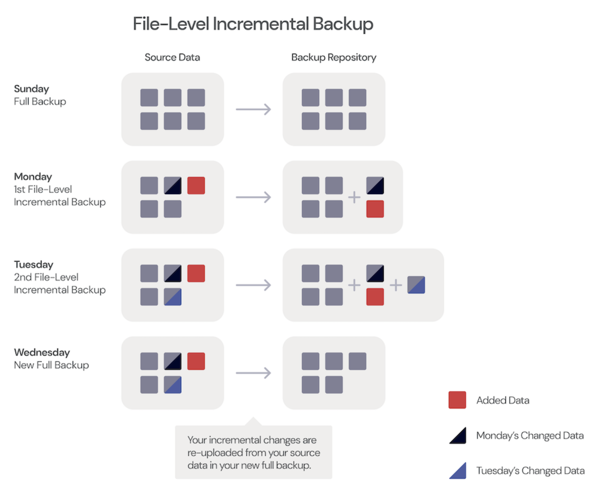
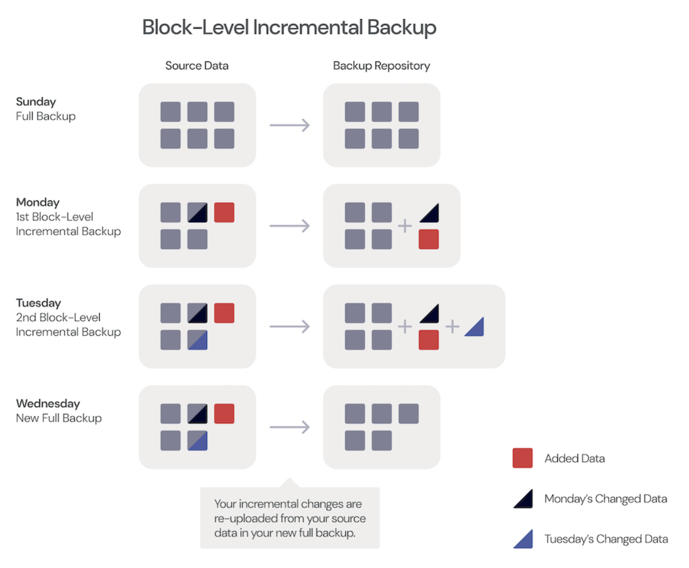
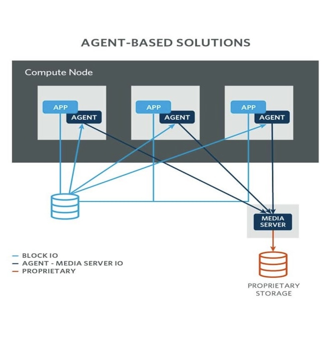
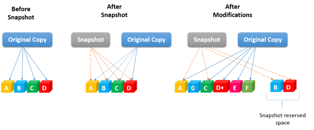
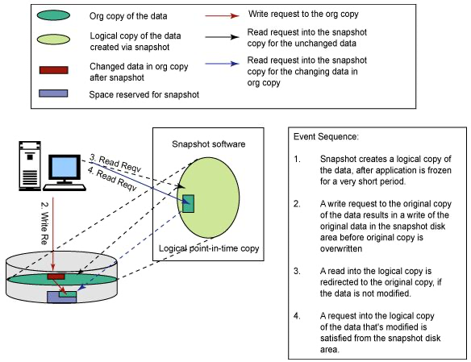
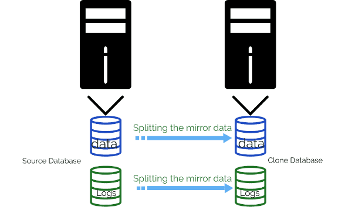

# Tìm hiểu chung về Backup, Backup agent
# Backup
- **Backup** dữ liệu là quá trình sao chép dữ liệu trong hệ thống CNTT sang vị trí khác để có thể khôi phục nếu dữ liệu gốc bị mất. Quá trình backup nhằm mục đích bảo toàn dữ liệu trong trường hợp thiết bị bị lỗi, bị tấn công mạng, thiên tai hoặc các trường hợp gây mất dữ liệu khác. Do đó, sao lưu dữ liệu là một phần quan trọng trong chiến lược bảo vệ dữ liệu của doanh nghiệp, thường bao gồm kế hoạch khôi phục thảm hoạ và duy trì hoạt động kinh doanh của nhiều tổ chức.

# Các phương pháp backup dữ liệu
- ## 1. Sao lưu đầy đủ (Full Backup)
Phương pháp sao lưu đầy đủ sẽ tạo ra một bản sao lưu đầy đủ của tất cả dữ liệu ở mỗi lần sao lưu , lưu trữ theo đúng dạng thức ban đầu của dữ liệu hoặc nén lại và mã hoá. Các bản sao đầy đủ tổng hợp sẽ tạo ra các bản sao lưu đầy đủ từ một bản sao lưu đầy đủ, kèm theo một hoặc nhiều bản sao lưu gia tăng. Hầu hết các tổ chức chỉ thực hiện sao lưu toàn bộ theo định kỳ vì quá trình này tốn nhiều thời gian. Tuy nhiên, sao lưu toàn bộ sẽ cung cấp khả năng phục hồi dữ liệu nhanh chóng khi được yêu cầu.
- ## 2. Sao lưu gia tăng (Incremental backup)
Phương pháp sao lưu gia tăng sao chép mọi dữ liệu đã được thay đổi kể từ lần sao lưu gần nhất, bất kể phương pháp sao lưu gần nhất là gì. Phương pháp sao lưu gia tăng đảo ngược sẽ bổ sung mọi dữ liệu đã được thay đổi vào bản sao lưu đầy đủ gần nhất. Các bản sao lưu như vậy có xu hướng chiếm ít dung lượng lưu trữ hơn so với các bản sao lưu khác biệt, vốn tăng dần theo thời gian và chúng cũng mất ít thời gian hơn để hoàn thành. Tuy nhiên, việc khôi phục dữ liệu sẽ mất nhiều thời gian hơn vì nó yêu cầu bản sao lưu toàn bộ ban đầu cộng với mỗi bản sao lưu gia tăng.
- ## 3. Sao lưu khác biệt (Differential Backup)
Phương pháp sao lưu khác biệt sẽ sao chép mọi dữ liệu kể từ lần sao lưu đầy đủ gần nhất, bất kể có bản sao lưu nào khác được tạo ra bằng bất kỳ phương pháp nào khác trong thời gian đó hay không. Thời gian sao lưu nhanh hơn so với sao lưu toàn bộ, nhưng việc khôi phục dữ liệu yêu cầu bản full backup ban đầu và bản sao lưu khác biệt mới nhất.

# Cơ chế hoạt động của Backup
## 1. Xác định dữ liệu cần backup:
- `File-level backup`: Phương pháp sao lưu dữ liệu trong đó từng tệp được sao lưu riêng lẻ vào backup repo. Thay vì sao chép toàn bộ ổ đĩa hoặc hệ thống tệp, chỉ sao chép các tệp được chỉ định hoặc các tệp đã thay đổi kể từ lần sao lưu cuối cùng. Điều này lâu hơn block-level backup bởi vì phần mềm backup sẽ phải quét toàn bộ file để xem có sự thay đổi nào kể từ lần sao lưu đầy đủ cuối cùng và sau đó mới sao lưu lại toàn bộ tệp đã sửa đổi.

#### Đặc điểm của File-level backup:
1. Lưu trữ tệp riêng lẻ: Từng tệp được sao lưu một cách riêng lẻ, thay vì sao lưu toàn bộ khối dữ liệu hoặc toàn bộ ổ đĩa 
2. Dễ dàng phục hồi: Có thể dễ dàng phục hồi từng tệp hoặc thư mục mà không cần phục hồi toàn bộ hệ thống
3. Chọn lọc tệp: Người dùng có thể chọn các tệp hoặc thư muc cụ thể để sao lưu giúp tiết kiệm dung lượng lưu trữ và thời gian sao lưu.
4. Quản lý phiên bản: Cho phép lưu giữ nhiều phiên bản của cùng một tệp
- `Block-level backup`: Không sao chép toàn bộ tệp nếu chỉ một phần của tệp đó đã thay đổi, chỉ phần đã thay đổi của tệp đã được gửi đến backup repo. Do đó, block-level backup nhanh hơn và yêu cầu ít không gian lưu trữ hơn 
Block-level backups sẽ snapshot volume đang chạy và dữ liệu được đọc từ snapshot. Điều này cho phép sao chép các files ngay cả khi chúng đang được sử dụng trong chương trình khác đang chạy và cũng làm giảm tác động đến hiệu suất của máy trong quá trình sao lưu.

- `Image-level backup`: Sao lưu toàn bộ hình ảnh của hệ thống, bao gồm cả hệ điều hành và các ứng dụng.
## 2. Chọn phương pháp backup:
- `Full Backup`: Tốn thời gian và dung lượng lưu trữ nhưng đảm bảo đầy đủ dữ liệu.
- `Incremental Backup`: Tiết kiệm dung lượng và thời gian, nhưng việc khôi phục dữ liệu có thể phức tạp hơn.
- `Differential Backup`: Nhanh hơn full backup và đơn giản hơn incremental backup khi khôi phục dữ liệu.
## 3. Quá trình backup:
- `Thu thập dữ liệu`: Cài đặt Backup agent hoặc phần mềm backup lên máy chủ, máy trạm, máy ảo... cần backup
- `Cài đặt jobs backup`: tự động chạy các jobs theo các plan đã tạo sẵn
- `Nén và mã hoá (nếu cần)`: Dữ liệu có thể được nén để tiết kiệm dung lượng lưu trữ và mã hoá để đảm bảo an toàn.
- `Chuyển dữ liệu`: Dữ liệu được chuyển đến đích lưu trữ, có thể là một máy chủ khác, ổ đĩa ngoài, dịch vụ lưu trữ đám mây(S3, Google Drive, One Drive,...) hoặc băng từ.
## 4. Lưu trữ dữ liệu:
- `Local Storage`: Dữ liệu được lưu trữ trên các thiết bị lưu trữ tại chỗ như ổ cứng, NAS (Network Attached Storage) hoặc SAN (Storage Area Network) 
- `Remote Storage`: Dữ liệu được lưu trữ tại một vị trí từ xa, có thể là một trung tâm dữ liệu khác hoặc dịch vụ đám mây.
- `Offsite Storage`: Dữ liệu được lưu trữ tại một địa điểm khác hoàn toàn, thường dùng để đảm bảo an toàn trong trường hợp thiên tai hoặc sự cố lớn tại vị trí chính.
## 5. Kiểm tra và xác nhận backup:
- `Theo dõi và kiểm tra các jobs backup hoạt động đúng và đầy đủ` 
- `Kiểm thử tính toàn vẹn của dữ liệu backup`: Đảm bảo rằng dữ liệu backup không bị lỗi hoặc mất mát.
- `Log và báo cáo`: Ghi lại quá trình backup và tạo báo cáo để có thể kiểm tra.
## 6. Khôi phục dữ liệu (Restore)
- `Chọn phiên bản backup`: Chọn phiên bản backup cần khôi phục.
- `Giải nén và giải mã`: Nếu dữ liệu đã được nén và mã hoá, quá trình giải nén và giải mã sẽ diễn ra
- `Chuyển dữ liệu về hệ thống nguồn`: Dữ liệu được khôi phục về vị trí gốc hoặc một vị trí mới theo yêu cầu.

# Agent-based vs Agentless Backup

## 1. Traditional Agent-based Backup (guest based backup)
Agent-based backup còn được gọi là sao lưu dựa trên máy khách. Agent trong backup là module phần mềm được cài đặt trên mọi máy chủ để thực hiện một số tác vụ nhất định.Agent-based backup phù hợp cho các sản phẩm yêu cầu người dùng cài đặt phiên bản lightweight của phần mềm trên mỗi máy mà họ muốn bảo vệ. Nếu agent được cài đặt trên máy ảo thì nó sẽ xem máy ảo như là một máy vật lý. Agent trong trường hợp này đang đọc dữ liệu từ đĩa và truyền dữ liệu đến máy chủ sao lưu. Agent software nằm ở lớp kernel level ở trong hệ thống do đó nó có thể phát hiện các thay đổi ở cấp độ block-level trên máy chủ.

Agent-based backups không yêu cầu quét toàn bộ hệ thống tệp để xác định các thay đổi cho các bản sao lưu điều này làm nó hiệu quả hơn so với agentless backups cho máy chủ. Phải có tài nguyên local computing resources cho agent-based backups để thực hiện quá trình backup dữ liệu và chuyển chúng đến vị trí sao lưu phù hợp. Do đó, quá trình backup có thể ảnh hưởng đến hiệu suất ứng dụng nếu máy chủ không có đủ sức mạnh tính toán cần thiết cho quá trình backups khi xét đến khối lượng công việc cần phải backup nhiều.

Ngoài ra, khi quản trị viên hệ thống làm việc trong môi trường bao gồm cả máy chủ vật lý và máy chủ ảo, agent-based backups thường được yêu cầu cho máy chủ vật lý. 

### Image-based Backup
Loại backups này sẽ chụp nhanh(`snapshot`) toàn bộ ổ đĩa và bộ nhớ của máy chủ. Không cần phải cài đặt lại hệ điều hành và khôi phục một bản vá của các tệp để sao chép hệ thống trước đó, điều này là cần thiết với các hệ thống sử dụng non-image-based backup. Ngay cả sau khi xảy ra lỗi hoàn toàn thì việc khôi phục toàn bộ hệ thống system image có thể được thực hiện trong vài phút và không có khả năng thiếu các tệp quan trọng, điều này có khả năng xảy ra trong non-image-based backup do chỉ hoạt động ở file level.  

### Non-image-based Backup
Non-image-based Backup hoạt động ở file level sử dụng hệ thống agent-based cho việc khôi phục các tệp bị mất, bị hỏng hoặc bị xoá. Loại backups này không thể khôi phục toàn bộ hệ thống. Tuy nhiên có thể khôi phục lại tệp rất chi tiết.

## Pros:
- Cả máy chủ vật lý và máy chủ ảo đều được bảo vệ theo cùng một phương pháp
- Rất tin cậy do chúng sở hữu khả năng kiểm soát đáng kể đối với hệ thống máy chủ. Vì các agents được đặt ở cấp độ kernel level nên chúng cung cấp quyền truy cập trực tiếp vào các thay đổi trong các sector đĩa. Do đó người dùng được cung cấp bản sao lưu nhanh hơn và đáng tin cậy hơn.
- Nhờ được tích hợp chặt chẽ với dịch vụ Microsoft's volume shadow copy nên các bản backups dựa trên agent-based có thể thiết lập các bản backups nhất quán với ứng dụng.  
- Thích hợp với Highly Transactional Virtual Machines: Các agents có lợi cho highly transactional virtual machines với cơ sở dữ liệu bao gồm các thực thể như SQL hoặc exchange. Vì volume shadow service có thể ngắt các transactions này ở một snapshot nên có khả năng xảy ra lỗi. Ngoài ra, agent-based backups dựa vào các tài nguyên tính toán của máy đang được sao lưu nên tốc độ xử lý của nhiều giai đoạn được cải thiện.
- Người sử hữu ứng dụng có thể quản lý backup và khôi phục lại Guest OS.
- Đây là cách duy nhất để bảo vệ máy ảo VMware Fault Tolerant và máy ảo với Physical Raw Disk Mapping RDMS.
## Cons:
- Sử dụng tài nguyên CPU, memory, I/O và tài nguyên mạng cao hơn đáng kể trên các máy chủ ảo khi chạy backups
- Cần cài đặt và quản lý agent trên mỗi máy ảo
- Chi phí có thể cao đối với các giải pháp cấp phép theo từng agent thay vì cấp phép theo từng hypervisor
- Có thể cần nhiều loại phương pháp sao lưu và khôi phục: VD: cần các chính sách sao lưu riêng cho các bản sao lưu tệp và thư mục, các bản sao lưu Microsoft Exchange, bare metal recovery,...
- Các chiến lược khôi phục disaster phức tạp
- Không có biện pháp bảo vệ cho các máy ảo ngoại tuyến và các máy ảo template
- Có thể xảy ra downtimes và vấn đề bảo trì: Người quản trị phải khởi động lại hệ thống để cài đặt agent nên có thể xảy ra downtime trong quá trình cài đặt và cần thời gian để active đặc biệt là trong các mạng lớn.

## 2. Agentless Backup (host-based backup)
Agentless backup còn gọi là sao lưu dựa trên máy chủ, đề cập đến giải pháp không yêu cầu phải cài đặt agent trên mỗi máy ảo. Tuy nhiên điều quan trọng là phần mềm có thể đưa agent vào máy khách mà ta không hề biết.
Giải pháp này tích hợp với VMware APIs for Data Protection (VADP) hoặc Microsoft VSS, tạo ra các bản snapshots nhanh, hiệu suất cao của các đĩa ảo gắn với các VMs. Phần mềm backup sẽ giao tiếp với VADP hoặc VSS và cho biết những gì nó muốn sao lưu. VADP và VSS thực hiện 1 số bước và lần lượt chuẩn bị dữ liệu để backup. Nhà cung cấp VSS/VADP sẽ snap ổ đĩa và cấp cho backup solution quyền truy cập vào snapshot bằng cách đưa tệp cho máy chủ backup. Sau đó backup solution sẽ sao lưu lại snapshot đó.

<!--- Update: 8/8/2024 --->
# Cloud Storage
### 1. Object storage
Object storage là một phương pháp lưu trữ dữ liệu trong đó dữ liệu được lưu trữ dưới dạng các đối tượng (objects). Mỗi đối tượng bao gồm dữ liệu thực tế, siêu dữ liệu (metadata) mô tả dữ liệu đó, và một định danh duy nhất (unique identifier) cho phép truy xuất đối tượng đó. Đây là một hình thức lưu trữ rất phổ biến trong môi trường Cloud, nhờ vào khả năng mở rộng và quản lý dễ dàng.
#### Đặc điểm của Object Storage:
##### 1. Cấu trúc đối tượng: 
- Dữ liệu được lưu trữ dưới dạng các đối tượng. Mỗi đối tượng bao gồm:

    - Data: Nội dung thực tế của tệp
    - Metadata: Thông tin mô tả về dữ liệu: kích thước, loại tệp và các thông tin do người dùng định nghĩa
    - Unique Id: Một ID duy nhất dùng để truy cập đối tượng
##### 2. Khả năng mở rộng:
- Object storage có khả năng mở rộng vô hạn, giúp dễ dàng lưu trữ một lượng lớn dữ liệu
##### 3. Quản lý đơn giản:
- Không yêu cầu cấu trúc thư mục phức tạp. Các đối tượng được lưu trữ trong một không gian phẳng không cần phải cấu trúc thư mục với các định danh duy nhất.
##### 4. Tính bền vững:
- Được thiết kế để đảm bảo tính toàn vẹn và bền vững của dữ liệu, thường được sử dụng các phương pháp như sao chép dữ liệu và mã hoá dữ liệu để bảo vệ thông tin. 

### 2. File Storage
File storage là một phương pháp lưu trữ dữ liệu trong đó dữ liệu được tổ chức và quản lý dưới dạng tệp trong một hệ thống tệp (file system). Dữ liệu được lưu trữ theo cấu trúc thư mục (directory) và các thư mục con (subdirectory), tương tự như cách sắp xếp tệp và thư mục trên một máy tính cá nhân. File storage thường được sử dụng trong các hệ thống mạng chia sẻ tệp (file-sharing networks), máy chủ tệp (file servers), và các thiết bị lưu trữ mạng (NAS).
#### Đặc điểm của File Storage:
##### 1. Tổ chức tệp:
- Dữ liệu được lưu trữ dưới dạng tệp và được sắp xếp trong các thư mục và thư mục con. 
##### 2. Hệ thống tệp:
- Sử dụng một hệ thống tệp để quản lý và tổ chức dữ liệu. Các hệ thống tệp phổ biến bao gồm: NTFS, FAT, HFS+, APFS, EXT4
##### 3. Truy cập dễ dàng:
- Dễ dàng truy cập và quản lý các tệp thông qua giao diện người dùng 
##### 4. Quản lý quyền truy cập:
- Hệ thống tệp cung cấp các cơ chế để quản lý permissions và ownership đối với các tệp và thư mục
##### 5. Chia sẻ tệp:
- Thường được sử dụng trong môi trường mạng để chia sẻ tệp giữa nhiều người dùng hoặc hệ thống

### 3. Block Storage
Block storage là một phương pháp lưu trữ dữ liệu mà trong đó dữ liệu được chia thành các khối (blocks) có kích thước cố định. Mỗi khối dữ liệu được lưu trữ riêng biệt với một địa chỉ duy nhất, cho phép hệ thống truy xuất trực tiếp đến bất kỳ khối nào mà không cần phải đọc toàn bộ file. Block storage thường được sử dụng trong các hệ thống lưu trữ mạng (SAN), trong môi trường Cloud và các trung tâm dữ liệu, nhờ vào hiệu suất cao và khả năng quản lý linh hoạt.
#### Đặc điểm của Block Storage:
##### 1. Chia khối dữ liệu:
- Dữ liệu được chia thành các khối có kích thước cố định (512 byte - 4KB)
##### 2. Địa chỉ duy nhất:
- Mỗi khối có một địa chỉ duy nhất cho phép truy cập trực tiếp đến bất kỳ khối nào mà không cần phải đọc toàn bộ file
##### 3. Hiệu suất cao:
- Block storage cung cấp hiệu suất cao, phù hợp với các ứng dụng yêu cầu truy cập dữ liệu nhanh chóng và độ trễ thấp như cơ sở dữ liệu và máy ảo
##### 4. Tính linh hoạt:
- Các khối có thể được sử dụng để tạo các hệ thống tệp, khối lượng dữ liệu (volumes), đĩa ảo( virtual disk) cung cấp tính linh hoạt trong việc quản lý dữ liệu
##### 5. Khả năng mở rộng:
- Block storage có thể dễ dàng mở rộng bằng cách thêm các khối lưu trữ bổ sung không ảnh hưởng đến hiệu suất hệ thống 

# Storage Snapshot Technology
## Copy-on-Write Snapshots
- Trước khi snapshot được tạo, hệ thống lưu metadata vào block gốc
- Khi hệ thống thực thi lệnh write để bảo vệ 1 block, nó sẽ kích hoạt 3 luồng IOs:
    - Snapshot utility sẽ read khối original trước khi khối đó được ghi
    - Bản snapshot của block gốc được written ra ở 1 vùng lưu trữ  snapshot.
    - Dữ liệu mới sẽ được ghi đè lên trên dữ liệu gốc

Pros: Copy-on-write snapshots không tạo ra các bản sao của metadata => nhanh, gần như tức thì

Cons: Đòi hỏi nhiều hiệu suất vì mỗi snapshot yêu cầu 1 lần đọc và 2 lần ghi

## Redirect-on-Write Snapshots
Sử dụng con trỏ để tham chiếu đến các khối snapshot-protected
- Hệ thống thực thi lệnh write để thực hiện thay đổi đối với khối snapshot-protected 
- Snapshot utility chuyển lệnh write đến 1 block mới và con trỏ được cập nhật
- Dữ liệu cũ được giữ nguyên như 1 điểm tham chiếu thời điểm của block gốc

Pros: Trái ngược với copy-on-write, redirect-on-write snapshots tiêu thụ ít tài nguyên hơn vì mỗi khối đã sửa đổi chỉ tạo ra 1 luồng IO write duy nhất

Cons: Redirect-on-write phụ thuộc vào block gốc. Các sửa đổi bổ sung sẽ tạo ra các block mới. Trong trường hợp, snapshot bị xoá việc đối chiếu giữa nhiều block mới và block gốc sẽ trở nên phức tạp.

## Split-Mirror Snapshots
Tạo ra 1 bản sao hoàn chỉnh của storage volume gốc thay vì chỉ tạo snapshot cho các khối đã sửa đổi. Với split-mirror snapshots, có thể tạo snapshot cho toàn bộ hệ thống file, Logical unit numbers (LUNs) hoặc object storage volumes.

Pros: Khôi phục dữ liệu, sao chép và lưu trữ đơn giản hơn.
Toàn bộ ổ đĩa vẫn khả dụng ngay cả khi bản sao chính/bản gốc bị mất

Cons: Vì snapshot utility tạo snapshot cho toàn bộ volume mỗi lần nên đây là quá trình chậm hơn và tăng gấp đôi dung lượng lưu trữ cần thiết

## Log structure file architecture
Log files được sử dụng để theo dõi các lần write vào volume gốc. Khi cần restore lại data, các transactions được ghi trong logs track sẽ chạy theo hướng ngược lại. Mỗi yêu cầu writes được ghi vào volume gốc giống với cơ sở dữ liệu quan hệ

## Copy-on-Write with background copy

