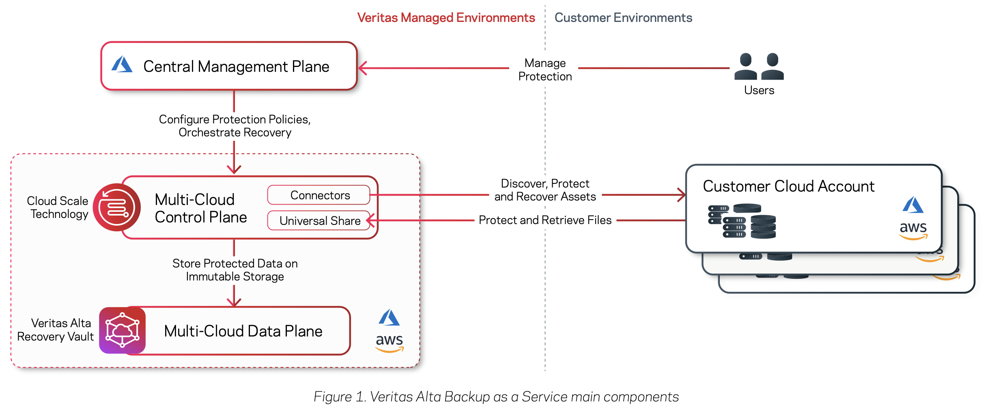
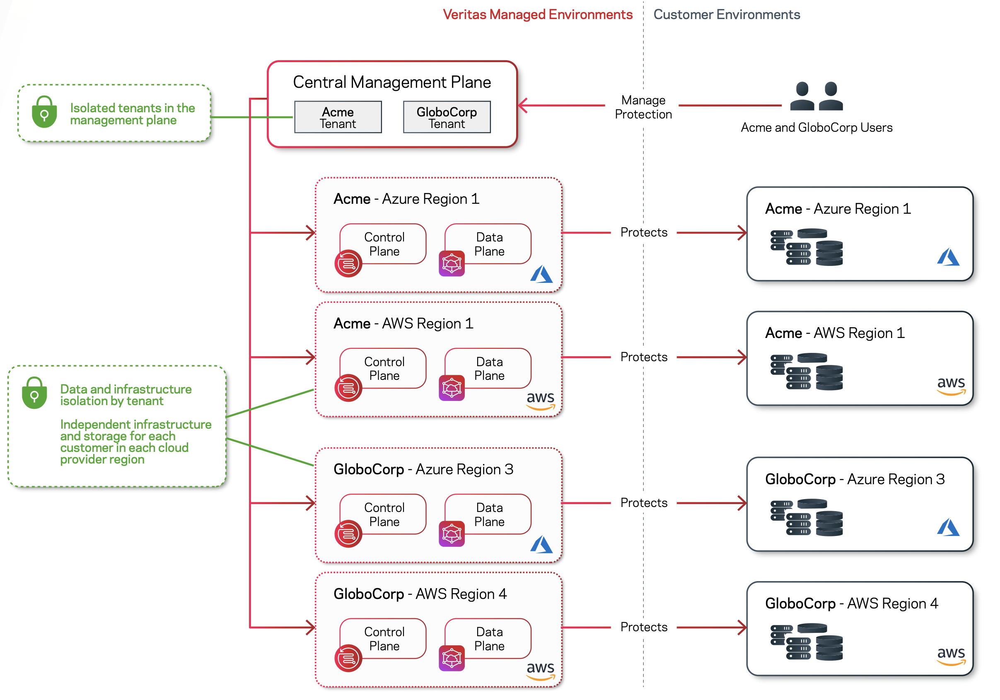

# Architecture

Backup as a Service comprises two main components; the management plane and the control plane plus data plane.
- The management plane is a central portal where customers manage their service from.
- The control plane orchestrates protection and recovery of assets. The data plane is co-located with the control plane, and secures
the backup data.

## Control Plane
The control plane is a crucial network component, making decisions on how data should be managed, routed, and processed. It acts as a supervisor of data, coordinating communication between different components and collecting data from the data plane.

Control planes utilize various protocols, such as:
- Routing protocols (like BGP, OSPF, and IS-IS)
- Network management protocols (SNMP)
- Application layer protocols (HTTP and FTP)

These protocols often employ software-defined networking (SDN) to create virtual networks and manage their traffic. Virtual networks, facilitated by SDN, are instrumental in managing data traffic at an enterprise level. They enable organizations to:

- Segment traffic
- Prioritize important data flows
- Isolate traffic from different parts of the network.

## Data Plane

While the control plane supervises and directs, the data plane is responsible for the actual movement of data from one system to another. It is the workhorse that delivers data to end users from systems and vice versa.
Some examples of data planes include:

- Ethernet networks
- Wi-Fi networks
- Cellular networks
- Satellite communications

Data planes can also include virtualized networks, like those created using virtual private networks (VPNs) or software-defined networks (SDNs). Additionally, data planes can include dedicated networks, like the Internet of Things (IoT) or industrial control systems.

Data planes allow organizations to quickly and securely transfer data between systems. For example, a data plane can enable the transfer of data between a cloud-based application and a local system. This functionality can be beneficial for organizations that need to access data from multiple systems or that need to quickly transfer large amounts of data.

By using dedicated networks, organizations can keep data secure through encryption, dedicated networks, and access monitoring to prevent unauthorized access of data.

## Key differences

The main differences between control and data planes are their purpose and how they communicate between different systems. The control plane decides how data is managed, routed, and processed, while the data plane is responsible for the actual moving of data. For example, the control plane decides how packets should be routed, and the data plane carries out those instructions by forwarding the packets.

# Data Isolation and Residency

- The control plane orchestrates protection and recovery of assets, storing metadata and managing the backup data. Veritas deploys
a separate control and data plane for each customer in each of their cloud service provider regions that they wish to protect. All data
from protected assets is stored in the same region as the asset itself; the data does not leave the region or the cloud service provider network.

- The management plane is a multi-tenant services that provides customers administrative access to configure protection of assets and
recovery. The management plane stores configuration information provided by the customer and metadata about the assets that are
discovered and protected.

- The control plane orchestrates protection and recovery of assets, storing metadata and managing the backup data. Veritas deploys
a separate control and data plane for each customer in each of their cloud service provider regions that they wish to protect. All data
from protected assets is stored in the same region as the asset itself; the data does not leave the region or the cloud service provider network.

The control plane, which is deployed in Azure or AWS depending on the assets to protect is strictly isolated using Azure and AWS network security mechanisms. 
The control plane cannot be remotely accessed from the public internet; the only outgoing connections allowed are to the management plane and the customer’s environment. 
An outbound-initiated connection to the management plane is used to report status and control asset protection. An outbound-initiated connection to a customer’s AWS or Azure account is used to protect assets; the control plane uses a private link service to ensure that data flows only over the AWS and Azure private network and not the internet.

