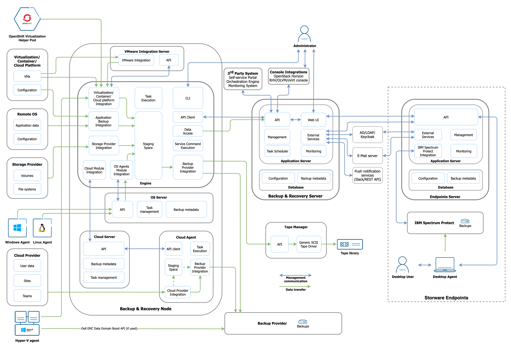
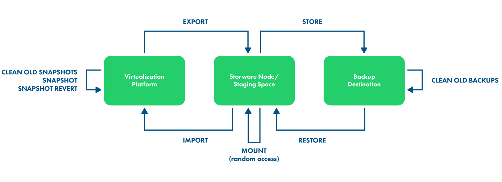
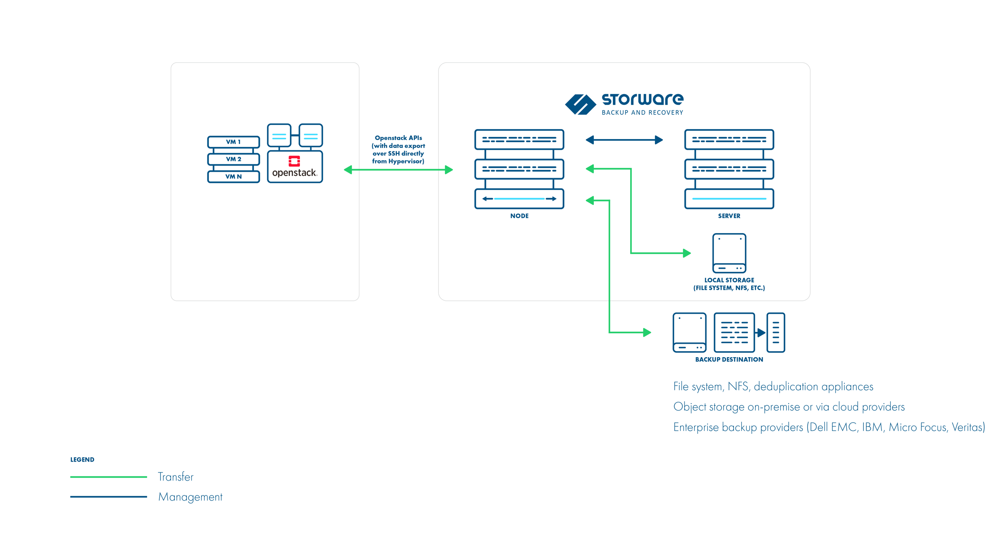
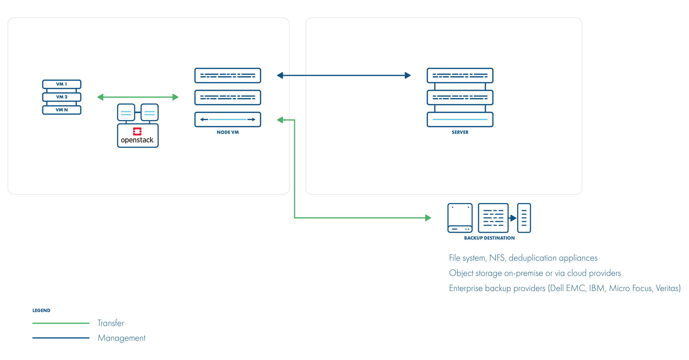

# Components and Architecture Backup and Recovery System

# Server - Control Plane

The server consists of database to track different information about the system such as configuration, permissions, and various metadata. Typically there is one Backup and Recovery server that can work and manage with multiple nodes. The server provides the administrative web UI.

# Node - Data Plane

This component is used to manage data movement. The component is responsible among others for performing operations like backup, restore, and mount. Multiple nodes can be connected and managed by the same Backup and Recovery server. Depending on the type of protected systems and data, multiple nodes can be deployed for example for scalability.

The node consists of the following sub-components:

## Cloud agent

Data mover that performs backups and restores operations for M365.

## Cloud server

This component is responsible for managing the metadata for M365 backup and restoring operations. The cloud server is using SQLite databases to track the metadata of M365 objects. The metadata databases are stored together with the data on the backup destination.

# Endpoints server

The Endpoint server provides the feature that allows for protecting data in the Continuous Data Protection (CDP) mode for the Windows operating system. The component is managed by the Backup and Recovery system.

## Endpoints client

The client is a component installed on the Windows operating system. It's responsible for monitoring the filesystem, detecting changes, and protecting data according to the assigned policy.

## IBM Spectrum Protect server

The endpoint protection supports only IBM Spectrum Protect as a backup destination. This component is delivered as a part of the solution.

# System Data Flow

Backup & Recovery components (server, node, and endpoints server) can be installed on the same host.

- The server can be installed on a physical machine or as a virtual machine - externally deployed nodes require network connectivity to the server and backup destinations.
- Nodes may be deployed as physical or virtual systems unless the selected backup strategy requires the node to be installed as a virtual machine on a Hypervisor Cluster (especially with the "disk attachment" export mode).

# Typical workflows

## Backup

- Export - a task that creates a backup or snapshot and exports data to the staging space
- Store - a task that moves data to the backup destination

## Restore to filesystem
- Restore - a task that gets data from a backup provider and puts data in the staging space

## Restore to a virtualization platform

- Restore - a task that gets data from a backup provider and puts data in the staging space (if it is a full backup that is being restored residing on the file system backup provider - this task just informs where files are waiting for import task)

- Import - a task that imports data to the virtualization platform and recreates VM

# Mount (file-level restore)

- Restore - a task that gets data from a backup provider and puts data in the staging space (if it is a full backup that is being restored residing on the file system backup provider - this task just informs where files are waiting for the mounting task)

- Mount - mounts backup on the Backup & Recovery Node and either allows user to browse files or exposes backup over iSCSI, so that remote iSCSI initiator can access it

# Protecting Virtual Environments
Backup & Recovery supports backup for OpenStack:
- Disk attachment through Cinder with changed block tracking (preferred):
    - supports all hypervisors and storages
    - supports incremental backup
    - proxy VM is required - used for the disk attachment process.
- Disk image transfer - for KVM hypervisors with VMs using QCOW2
- Volumes or Ceph-based storage:
    - supports incremental backup
    - disk images are transferred directly from API (no Proxy VM required)
- Disk attachment through Cinder:
    - supports all hypervisors and storages
    - no incremental backup
    - proxy VM is required - used for the disk attachment process.

## Backup Strategies
### Libvirt strategy

Storware Backup & Recovery supports OpenStack environments that use KVM hypervisors and VMs running on QCOW2 or RAW files. Storware Backup & Recovery communicates with OpenStack APIs such as Nova and Glance to collect metadata and for the import of the restored process. However, the actual backup is done over SSH directly from the hypervisor

### Backup process

- direct access to the hypervisor over SSH
- crash-consistent snapshot taken directly using virsh (QCOW2/RAW file), rbd snapshot for Ceph (separate call for each storage backend)
- optional application consistency using pre/post snapshot command execution • QCOW2/RAW-file data exported over SSH (optionally with netcat)
- Ceph RBD data exported using rbd export or RBD-NBD when incremental is used
- metadata exported from OpenStack APIs (nova, glance, cinder)
- the last snapshot kept on the hypervisor for the next incremental backup (if at least one schedule assigned to the VM has backup type set to incremental)
- restore recreates files/volumes according to their backend (same transfer mechanism as used in backup) and then defines VM on the hypervisor

### Disk attachment

Storware Backup & Recovery also supports the disk-attachment method using cinder. This should allow you to use cinder-compatible storage and still allow Storware Backup & Recovery to create backups. Incremental backup is supported in disk attachment changed block tracking (which has higher CPU overhead). Storware Backup & Recovery needs to communicate OpenStack service's API to attach drives to the proxy VM with Storware Backup & Recovery Node installed.

