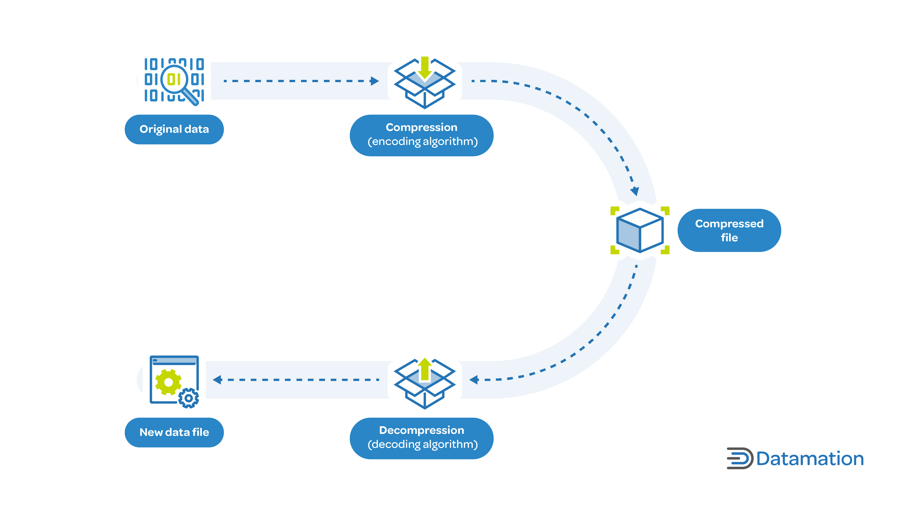
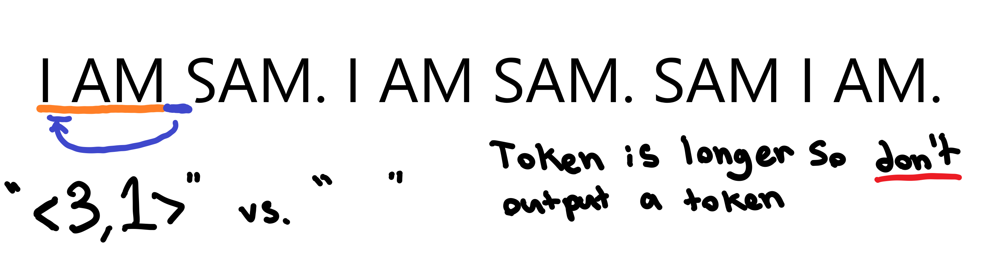
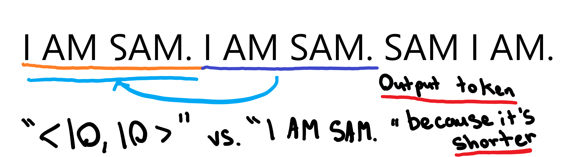

# Guide to Data Compression

Data compression is the process of using encoding, restructuring, and other modifications to reduce the size of digital data files without changing their fundamental properties. By reducing the size of files, data compression minimizes the network bandwidth required to share them and the capacity needed to store them, lowering costs. 

## How does Data Compression work ?

At a high level, data compression works by encoding the original, target data in fewer bits, reducing the size of the data. When needed, the data can be uncompressed, or decoded and retrieved.

The process involves two algorithms—one for compression and one for reconstruction. The original data is reduced into an encoded representation of itself. When accessing or retrieving the information, the reconstruction algorithm decompresses the data representation into a newer format to make it as similar to the original as possible.

Data compression is valuable because raw data is not ready to use. `Noise and redundancy` can inflate the footprint data occupies needlessly, requiring more storage capacity to retain it and more bandwidth to transmit it over a network. Noisy data refers to data that is distorted, corrupted, or unreadable, while redundant data refers to information that is repeated multiple times within the same dataset.

Data compression is aimed at eliminating redundancy and noise, improving the overall quality of the available information as well as reducing its size.

## Types of Data Compression
Generally speaking, there are four different types of data compression:

- `Text Compression`: primarily uses codes or symbols for patterns and redundancies; reduces overall size, but information remains unaltered.

- `Audio Compression`: eliminates noise to shrink file sizes, but reduces overall quality.

- `Image Compression` : similar to text compression; replaces repeated color patterns using codes to reduce size.

- `Video Compression` : a combination of audio and image compression, removes unwanted images and background noise to reduce overall size at the expense of quality.



## Data Compression Techniques

## Lossless Compression
Lossless data compression is non-destructive—it retains the original information and preserves the original file structure, maintaining absolute quality. The original version can be entirely restored. Common applications of lossless compression techniques are archiving and formatting.

It’s primarily used for executable files like documents, software applications, spreadsheets, texts, or other critical system files. Familiar lossless compression formats include ZIP, GIF, PDF, and PNG.

## Lossy Compression

Lossy data compression reduces the original size of the data by compromising some detail—it permanently removes unnecessary bits. Although it only discards unimportant information, it still affects the data quality. Common applications of lossy compression are multimedia files such as audio, photos, graphics, and videos.

Good results are possible when executed effectively, but aggressive compression can affect the file quality considerably. As a result, it’s used when some degree of quality loss can be tolerated. The most familiar formats include JPEG, MPEG, MP3, MP4, and MOV.

# Data Compression Algorithms

## 1. Run Length Encoding (RLE)

This lossless method reduces the number of bits used in data representation. Overall size is reduced but no information is lost. For example, if the data set includes several repeated characters—such as “aaaabbbbcccddee,” the RLE algorithm encodes it as “4a4b3c2de.” The same information is available in fewer bytes, but the data sequence remains unaltered.

## 2. [Huffman Coding](../huffman/)

Another lossless algorithm, this is primarily used for data sets consisting of frequently occurring characters. It generates a unique code for each character based on frequency—when the string is represented using these codes, overall size is reduced but the data remains unaffected.

## 3. Lớp các thuật toán Lempel-Ziv

Lempel-Ziv, commonly referred to as `LZ77/LZ78` depending on the variant, is one of the oldest, most simplistic, and widespread compression algorithms out there. Its power comes from its simplicity, speed, and decent compression rates. Now before we dive into an implementation, let’s understand the concept behind Lempel-Ziv and the various algorithms it has spawned.

### The Algorithms

Lempel-Ziv at its core is very simple. It works by taking an input string of characters, finding repetitive characters, and outputting an “encoded” version. To get an idea of it, here’s an example.
```
Original: Hello everyone! Hello world!
Encoded: Hello everyone! <16,6>world!
```

As you can see, the algorithm simply takes an input string, in this case, “Hello everyone! Hello world!”, and encodes it character by character. If it tries to encode a character it has already seen it will check to see if it has seen the next character. This repeats until it the character it’s checking hasn’t been seen before, following the characters it’s currently encoding, at this point it outputs a “token”, which is `<16,6>` in this example, and continues.

The `<16,6>` token is quite simple to understand too, it consists of two numbers and some syntactic sugar to make it easy to understand. The first number corresponds to `how many characters it should look backwards`, and the next number tells it `how many characters to go forwards and copy`. This means that in our example, <16,6> expands into “Hello “ as it goes 16 characters backwards, and copies the next 6 characters.

This is the essential idea behind the algorithm, however it should be noted that there are many variations of this algorithm with different names. For example, in some implementations, the first number means go `forwards from the beginning` instead of `backwards from the current position`. Small (and big) differences like these are the reason for so many variations:

- LZSS - Lempel-Ziv-Storer-Szymanski
- LZW - Lempel-Ziv-Welch
- LZMA - Lempel–Ziv–Markov chain algorithm
- LZ77 - Lempel-Ziv 77
- LZ78 - Lempel-Ziv 78

### [Lempel-Ziv-Storer-Szymanski](../lzss/)

Lempel-Ziv-Storer-Szymanski, which we’ll refer to as LZSS, is a simple variation of the common LZ77 algorithm. It uses the same token concept with an offset and length to tell the decoder where to copy the text, except it only places the token when the token is shorter than the text it is replacing.

The idea behind this is that it will never increase the size of a file by adding tokens everywhere for repeated letters. You can imagine that LZ77 would easily increase the file size if it simply encoded every repeated letter “e” or “i” as a token, which may take at least 5 bytes depending on the file and implementation instead of just 1 for LZSS.

#### Implementing an Encoder

So let’s encode an excerpt of Dr. Seuss’s Green Eggs and Ham with LZSS (credit to Wikipedia for this example).

```
I AM SAM. I AM SAM. SAM I AM.

THAT SAM-I-AM! THAT SAM-I-AM! I DO NOT LIKE THAT SAM-I-AM!

DO WOULD YOU LIKE GREEN EGGS AND HAM?

I DO NOT LIKE THEM,SAM-I-AM.
I DO NOT LIKE GREEN EGGS AND HAM.
```

This text takes up 192 bytes in a typical UTF-8 encoding. Let’s take a look at the LZSS encoded version.

```
I AM SAM. <10,10>SAM I AM.

THAT SAM-I-AM! T<15,14>I DO NOT LIKE<29,15>

DO WOULD YOU LIKE GREEN EGGS AND HAM?

I<69,15>EM,<113,8>.<29,15>GR<64,16>.
```

As we can see, the “tokens” are reducing the size of the file by referencing pieces of text that are longer than the actual token. Let’s look at the first line:

```
I AM SAM. <10,10>SAM I AM.
```

The encoder works character by character. On the first character, ‘I’, it checks it’s search buffer to see if it’s already seen an ‘I’. The search buffer is essentially the encoder’s memory, for every character it encodes, it adds it into the search buffer so it can “remember” it. Because it hasn’t seen an ‘I’ already (the search buffer is empty), it just outputs an ‘I’, adds it to the search buffer, and moves to the next character. The next character is ‘ ‘ (a space). The encoder checks the search buffer to see if it’s seen a space before, and it hasn’t so it outputs the space and moves forward.

Once it gets to the second space (after “I AM”), LZ77 comes into play. It’s already seen a space before because it’s in the search buffer so it’s ready to output a token, but first it tries to maximize how much text the token is referencing. If it didn’t do this you could imagine that for every character it’s already seen it would output something similar to <5,1>, which is 5 times larger than any character. So once it finds a character that it’s already seen, it moves on to the next character and checks if it’s already seen the next character directly after the previous character. Once it finds a sequence of characters that it hasn’t already seen, then it goes back one character to the sequence of characters it’s already seen and prepares the token.

Once the token is ready, the difference between LZ77 and LZSS starts to shine. At this point LZ77 simply outputs the token, adds the characters to the search buffer and continues. LZSS does something a little smarter, it will check to see if the size of the outputted token is larger than the text it’s representing. If so, it will output the text it represents, not the token, add the text to the search buffer, and continue. If not, it will output the token, add the text it represents to the search buffer and continue.



Coming back to our example, the space character has already been seen, but a space followed by an “S” hasn’t been seen yet (“ S”), so we prepare the token representing the space. The token in our case would be “<3,1>”, which means go back three characters and copy 1 character(s). Next we check to see if our token is longer than our text, and “<3,1>” is indeed longer than “ “, so it wouldn’t make sense to output the token, so we output the space, add it to our search buffer, and continue.

This entire process continues until we get to the “I AM SAM. “. At this point we’ve already seen an “I AM SAM. “ but haven’t seen an “I AM SAM. S” so we know our token will represent “I AM SAM. “. Then we check to see if “I AM SAM. “ is longer than “<10,10>”, which it is, so we output the token, add the text to our search buffer and continue along.



This process continues, encoding tokens and adding text to the search buffer character by character until it’s finished encoding everything.

### Sliding Window


The “sliding window” is actually quite simple, all you do is cap off the maximum size of the search buffer. When you add a character to the search buffer that makes it larger than the maximum size of the sliding window then you remove the first character. That way the window is “sliding” as you move through the file, and the algorithm doesn’t slow down!

## 4. [Dictionary Coding](../dictionary/)
Dictionary coding is a broader category of data compression methods that rely on predefined dictionaries to compress and decompress data. These dictionaries contain common data patterns and data is replaced with references to the dictionary entries, resulting in smaller file sizes.

## 5. Dynamic Markov Compression (Hardcore) - find out later
Markov Chains Compression sits at the cutting edge of compression algorithms. These algorithms take an Artificial Intelligence approach to compression by allowing the encoder and decoder to 'predict' what data is coming next. In this episode Colt McAnlis talks about how these magical algorithms compress data, and why some think that they are the future of compression.

## 6. Arithmetic Coding (Hardcore) - find out later
Arithmetic coding (AC) is a form of entropy encoding used in lossless data compression. Normally, a string of characters is represented using a fixed number of bits per character, as in the ASCII code. When a string is converted to arithmetic encoding, frequently used characters will be stored with fewer bits and not-so-frequently occurring characters will be stored with more bits, resulting in fewer bits used in total. 

## 7. Deflate

A combination of the LZSS and Huffman coding algorithms, this lossless technique was initially developed for ZIP files but is now also used for gzip in HTTP compression and PNG formats. It works by finding repeated character sequences and encoding them based on frequency.

Then it uses Huffman coding to compress the data a second time using shorter codes, reducing size considerably. Popularly used for web content compression, it enhances the browsing experience by compressing HTTP responses and reducing load times and bandwidth.

## 8. Audio and Video Codecs
Encompassing a wide range of algorithms, these advanced techniques offer significant compression for media files. The popular MP3 format used for audio files utilizes perceptual coding, removing data that is less noticeable to listeners and reducing file sizes.

Similarly, high-efficiency video coding (HEVC), or H.264, compresses video files using entropy coding and motion compensation. This leads to higher compression ratios without compromising visual quality. This video codec is what makes high definition video streaming and conferencing possible.

## File Compression Formats

### 1. 7Z
Supported Compression Methods in 7Z
- LZMA - Improved and optimized version of the LZ77 algorithm
- LZMA2 - Improved version of LZMA
- PPMD - Dmitry Shkarin’s PPMdH with small changes
- BCJ - Converter for 32-bit x86 executables
- BCJ2 - Converter for 32-bit x86 executables
- BZIP2 - Standard BWT algorithm
- Deflate - Standard LZ77-based algorithm

### 2. BIN
A BIN file, in the context of Macintosh computers, can refer to a file saved in the MacBinary format. MacBinary is a file format specifically designed for transferring Macintosh files over the internet, email, FTP, or portable media. The purpose of MacBinary is to preserve the complete file structure and attributes of Macintosh files, including both the data fork and resource fork, within a single file.

The MacBinary format achieves this by encapsulating the Macintosh Hierarchical File System (HFS) resource fork and data fork into a compressed file. It also includes a finder header that contains important metadata about the file. By combining all these components into one file, MacBinary ensures that the file retains its integrity and can be easily transferred and shared across different platforms.

With the advancements in Apple’s file systems and file transfer protocols, the use of BIN files and MacBinary format has become less common. The introduction of file formats like ZIP and the transition to more modern file systems, such as HFS+ and APFS, have reduced the need for MacBinary-encoded files. These newer file systems provide more efficient ways of handling file attributes, resource forks, and data forks, making the MacBinary format less necessary in today’s computing landscape.

### 3. TAR
Files with .tar extension are archives created with Unix-based utility for collecting one or more files. Multiple files are stored in an uncompressed format with the support of adding files as well as folders to the archive. TAR utility on Unix is Command based, but files hence created are supported by most file archiving systems on almost all operating systems.

#### TAR File Format
TAR is an open file format with full specifications available for developer’s reference. Its file structure was standardized in POSIX.1-1988 and later in POSIX.1-2001. The data sets created by tar retain information about file system parameters such as:

- Name
- Time Stamps
- Ownership
- File Access Permissions
- Directory Organization

A TAR file doesn’t have any magic number. It contains a series of blocks where each block is of BLOCKSIZE bytes.

Each file archived is represented by a header block which describes the file, followed by zero or more blocks which give the contents of the file. At the end of the archive file there are two 512-byte blocks filled with binary zeros as an end-of-file marker. A reasonable system should write such end-of-file marker at the end of an archive, but must not assume that such a block exists when reading an archive. In particular GNU tar always issues a warning if it does not encounter it.

The blocks may be blocked for physical I/O operations. Each record of n blocks (where n is set by the blocking-factor = 512-size option to tar) is written with a single “write()” operation. On magnetic tapes, the result of such a write is a single record. When writing an archive, the last record of blocks should be written at the full size, with blocks after the zero block containing all zeros. When reading an archive, a reasonable system should properly handle an archive whose last record is shorter than the rest, or which contains garbage records after a zero block.

### 4. gzip
gzip is based on the DEFLATE algorithm, which is a combination of LZ77 and Huffman coding. DEFLATE was intended as a replacement for LZW and other patent-encumbered data compression algorithms which, at the time, limited the usability of the compress utility and other popular archivers.

Although its file format also allows for multiple such streams to be concatenated (gzipped files are simply decompressed concatenated as if they were originally one file), gzip is normally used to compress just single files. Compressed archives are typically created by assembling collections of files into a single tar archive (also called tarball), and then compressing that archive with gzip. The final compressed file usually has the extension .tar.gz or .tgz.
