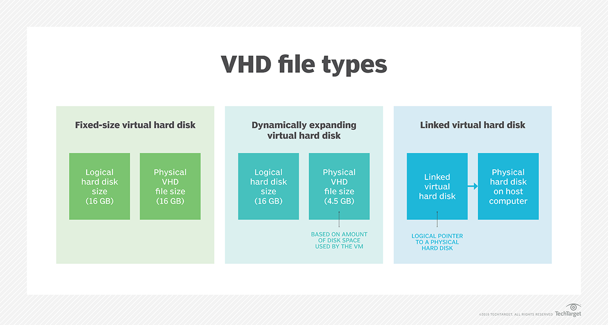

# Disk Image

A disk image is a snapshot of a storage device's structure and data typically stored in one or more computer files on another storage device

Traditionally, disk images were bit-by-bit copies of every sector on a hard disk often created for digital forensic purposes, but it is now common to only copy allocated data to reduce storage space. Compression and deduplication are commonly used to reduce the size of the image file set

Disk imaging is done for a variety of purposes including digital forensics, cloud computing, system administration, as part of a backup strategy, and legacy emulation as part of a digital preservation strategy. Disk images can be made in a variety of formats depending on the purpose. Virtual disk images (such as VHD and VMDK) are intended to be used for cloud computing, ISO images are intended to emulate optical media and raw disk images are used for forensic purposes. 

## Raw Image

Raw image format represents a plain, unstructured disk image with no compression or optimization applied. It provides direct access to the underlying storage device, resulting in optimal performance. Raw images are ideal for scenarios where performance is paramount, such as high-performance computing (HPC) clusters or database servers. However, raw images tend to occupy more disk space compared to qcow2 due to the absence of compression.

Raw images are essentially unformatted disk files, mirroring the physical structure of a hard disk drive. They offer:

- Performance: Raw images boast the highest potential performance due to the absence of overhead associated with additional formatting.
- Simplicity: Their straightforward structure simplifies data recovery in case of VM corruption.

However, raw images come with drawbacks:

- Storage Inefficiency: They occupy the entire allocated storage space, even for unused portions, leading to wasted storage capacity.
- Limited Snapshot Functionality: KVM and OpenStack primarily rely on snapshots for VM backups and rollbacks. Raw images themselves don’t natively support snapshots within the format, need to use external version control tools or convert the raw image to QCOW2 before taking snapshots.

## QCOW2 Image
Qcow2 (QEMU Copy-On-Write version 2) is a versatile disk image format that supports features like compression, snapshots, and thin provisioning. Qcow2 images offer better storage efficiency by utilizing compression techniques, resulting in smaller file sizes compared to raw images. The Copy-On-Write mechanism allows for efficient storage utilization by only writing changes to disk, making qcow2 suitable for scenarios requiring frequent snapshots or backups. However, the additional processing overhead associated with compression and Copy-On-Write may slightly impact performance compared to raw images.

### Advantages of Qcow2 Image Format

The qcow2 format is a popular choice for KVM/OpenStack environments, offering:

- Storage efficiency – qcow2 images store only the used data blocks, significantly reducing storage consumption compared to raw images.
- Qcow2 supports features like snapshots, live migration, and online resize, essential for VM management in KVM/OpenStack.
- Seamless Backup – qcow2 images seamlessly integrate with KVM and OpenStack backup solutions, simplifying data protection and recovery.
While qcow2 offers significant advantages, it comes with a slight performance overhead compared to raw images due to the additional layer of formatting.

### Disadvantages of qcow2 Images

- Complexity – qcow2 has advanced features. Hence, it is more complex to work with, and may require more expertise.
- Performance Overhead – the extra features in qcow2 and the COW mechanism can cause performance overhead.
- Fragmentation – images can become fragmented over time, especially when using snapshots and frequent disk writes. This fragmentation may cause slower read and write, increasing processing time.

## Key Differences Between Raw and Qcow2 Images

Choose Raw if:
- Absolute performance is the top priority.
- Data recovery is a major concern, and simplicity is preferred.

Choose Qcow2 if:
- Storage efficiency is critical.
- You require advanced VM management features like snapshots and live migration.
- Seamless integration with KVM/OpenStack backup solutions is essential.

# VDI vs VHD vs VMDK

## Virtual Hard Disk (VHD)

A virtual hard disk (VHD) is a disk image file format for storing the entire contents of a hard drive. It is a container that can store a virtual hard disk drive. The disk images, sometimes called virtual machine, replicates an existing hard drive and includes all data and structural elements. It can be stored in any location accessible to the physical host and it is also transportable, allowing it to be moved from one host to another.

VHDs are commonly used by virtualization software to store files and data. They are used to create virtual machines, which are software-based computers that run on a physical host computer. Virtual machines can be used to run multiple operating systems on a single physical computer, allowing users to run different applications and services on the same hardware.

## Virtual Hard Disk vs Physical Hard Disk
A virtual hard disk has similar functionality to a physical hard disk drive. For example, it often contains the same hard drive sectors, such as a file system, disk partitions, etc. It also appears and operates like a hard disk that's physically connected to the system. Like a hard disk, the VHD can do the following:
- create disk sectors, files, and folders
- run an operating system
- execute user applications

What differentiates the VHD from a physical hard disk is that it is designed for use by virtual machines and is installed on a virtual machine infrastructure, most commonly VMware Workstation and Hyper-V VMs.

While a VHD is created on a physical hard drive, it is a "virtualized" file and has its own logical distribution. Its disk size can be fixed or flexible. This size is managed by the operating system (OS) or virtualization manager. The OS communicates with the device drivers to access the VHD.

## Types of Virtual Hard Disks

### Fixed-size VHD
A fixed-size VHD is a disk image file that is created with a specific size. The entire disk space is allocated when the VHD is created, and the file size remains constant regardless of the amount of data stored on the virtual disk. Fixed-size VHDs are faster to create and provide better performance compared to dynamically expanding VHDs. However, they consume more physical disk space, as the allocated space is not used until data is written to the virtual disk.

### Dynamically expanding VHD

A dynamically expanding VHD is a disk image file that grows in size as data is written to the virtual disk. The initial size of the VHD file is small, and it expands dynamically as more data is stored on the virtual disk. Dynamically expanding VHDs are more space-efficient compared to fixed-size VHDs, as they only consume physical disk space for the data stored on the virtual disk. However, they may have slightly lower performance compared to fixed-size VHDs, as the VHD file needs to grow in size as data is written to the virtual disk.

### Differencing VHD

A differencing VHD is a disk image file that is used as a parent disk for other VHDs. It contains the base operating system or data that is shared among multiple virtual machines. Two VHDs are used, a parent and a child. When a differencing VHD is created, it references the parent VHD and stores only the changes made to the virtual disk. This allows multiple virtual machines to share the same base disk image while maintaining separate data and configurations. Differencing VHDs are commonly used in virtual machine environments to reduce storage space and simplify management of virtual disks.

## Benefits of Virtual Hard Disks

### Easy deployment
A VHD has provisions for pre-built and standard configurations in the VHD files for working on specific operating system environments, which simplifies deployment.
### Efficient backup and recovery
VHDs can be easily backed up and restored, allowing for quick recovery in case of system failures or data loss.
### Snapshot recovery
A snapshot of an existing VHD configuration can be recovered, allowing a user to revert to a previous stage if there are installation problems and troubleshooting doesn't offer any fixes.

### Swift replication
The work or file in one system can be replicated in another system by copying the VHD file, which is a simple and quick process.

### Isolation for users
Users can work on their chosen OS without affecting the host system, as the VHD is isolated from the host system.

### Cost-effective
VHDs are cost-effective as they reduce the need for physical hardware and allow multiple virtual machines to run on a single physical host.

## VHD vs VHDX

Virtual hard disk (VHD) is a disk format standard for Microsoft’s virtualization products, including the now-discontinued Microsoft Virtual PC and Virtual Server. VHD remains supported in the virtualization space despite the discontinuation of these products; however, it has been replaced by the Virtual Hard Disk v2 (VHDX) format, the default for the Microsoft Hyper-V hypervisor introduced in Windows 2012. The VHDX format boasts a substantial storage capacity of 64 TB compared to the lower 2 TB limit of VHD.

VHDX is functionally equivalent to VHD. However, it is an advanced version of VHD that  supports larger storage capacity, larger logical sectors and live disk resizing. VHDX also provides the following advantages over VHD:
- metadata updates tracking
- data protection against power failures
- more adaptable to new storage hardware
- improved alignment of the virtual hard disk format to work well on large sector disks
- support for custom metadata

The VHD and VHDX file format specifications are available to third parties, ensuring broad support across various virtualization platforms. Microsoft has also released application programming interfaces (APIs) to easily create Windows images in VHD files. Microsoft PowerShell scripts are also available for converting an existing virtual hard disk from dynamic to fixed and vice versa, from VHD to VHDX, or a pass-through disk to a virtual hard disk.

# Vitual Disk Image (VDI)

Virtual disk image (VDI) is the default disk format for Oracle VM VirtualBox, a popular open-source virtualization product. Virtual disks created in VirtualBox bear the .vdi extension. VDI is generally compatible with various virtualization programs.

VDI offers flexibility in storage allocation, supporting both fixed-size and dynamically allocated storage. This dynamic allocation feature allows for the expansion of an image file after its creation, even if it already houses data.

VDI files are more compact and outperform VHD or VHDX files on a few key criteria. However, they fall short in speed when compared to VMDK files. While VDI lacks support for incremental backups–a feature present in VMDK–it compensates with high-level redundancy, mitigating the impact of data loss on virtual machines.

It’s important to note that converting other formats to VDI isn’t always feasible. Also, devices must have VirtualBox installed before being equipped with a .vdi virtual disk. Users should strive to understand their virtualization software’s specific requirements and capabilities to ensure no compatibility or functionality issues arise during use.

# Virtual Machine Disk (VMDK)
Virtual machine disk (VMDK) was initially a proprietary format for VMware virtual appliances. Today, it has evolved into an open format and gained widespread acceptance across virtualization platforms, including Hyper-V and VirtualBox.

VMDK facilitates the cloning of physical hard disks and off-site VM backups. Once VMware vSphere 5.5 was introduced in 2013, VMDK’s storage capacity saw a 31-fold leap: from 2 TB to 62 TB. VMDK files can be dynamic (sparse) or fixed (flat). Dynamic disks, starting small, grow in tandem with the guest OS file size. Conversely, fixed disks remain static, and a large size is pre-allocated to them to accommodate anticipated VM usage growth.

A key feature of VMDK is its support for incremental backups, allowing data changes since the last backup to be stored. This feature, missing from VDI and VHD, accelerates the VMDK backup process.

VMDK also comes with several other advantages, including:
- Live migration enables VMs to be moved or migrated to another server
- Snapshots and continuous data protection (CDP) provides a safety net against data loss
- High-performance Storage Area Network (SAN) storage utilization enhances storage efficiency
- VM recreation and restart with backup VMDK files ensures business continuity

# Key Differences Between VDI, VHD, and VMDK
A VDI is the image of a virtual hard disk or the logical disk associated with a virtual machine. A VHD is a disk image file format used for the virtualized storage of the contents of a computer’s hard drive. Finally, a VMDK is a format specification for virtual machine disk image files.

| Features                 | VDI                                                                                                                                                                                                                                                                                                                                                                                                                                                                                                                                                                                                                                                                                                                                                                                                                           | VHD                                                                                                                                                                                                                                                                                                                                                                                                                                                                                                                                                                                                                                                                                                                                                                                                            | VMDK                                                                                                                                                                                                                                                                                                                                                                                                                                                                                                                                                                                                                                                                                                                                                                                                                                                                                                                                                              |
|--------------------------|--------------------------------------------------------------------------------------------------------------------------------------------------------------------------------------------------------------------------------------------------------------------------------------------------------------------------------------------------------------------------------------------------------------------------------------------------------------------------------------------------------------------------------------------------------------------------------------------------------------------------------------------------------------------------------------------------------------------------------------------------------------------------------------------------------------------------------|--------------------------------------------------------------------------------------------------------------------------------------------------------------------------------------------------------------------------------------------------------------------------------------------------------------------------------------------------------------------------------------------------------------------------------------------------------------------------------------------------------------------------------------------------------------------------------------------------------------------------------------------------------------------------------------------------------------------------------------------------------------------------------------------------------------------------------------------------------------------------------|--------------------------------------------------------------------------------------------------------------------------------------------------------------------------------------------------------------------------------------------------------------------------------------------------------------------------------------------------------------------------------------------------------------------------------------------------------------------------------------------------------------------------------------------------------------------------------------------------------------------------------------------------------------------------------------------------------------------------------------------------------------------------------------------------------------------------------------------------------------------------------------------------------------------------------------------------------------------------------------------------------------------------------|
| **File Extension**       | .vdi                                                                                                                                                                                                                                                                                                                                                                                                                                                                                                                                                                                                                                                                                                                                                                                                                         | .vhd                                                                                                                                                                                                                                                                                                                                                                                                                                                                                                                                                                                                                                                                                                                                                                                                            | .vmdk                                                                                                                                                                                                                                                                                                                                                                                                                                                                                                                                                                                                                                                                                                                                                                                                                                                                                                                                                              |
| **Operations**          | The VDI format was developed for Oracle’s open-source virtualization solution, VM VirtualBox. This format introduced a revolutionary method for interacting with operating systems. Simply put, it enables users to run programs written for various operating systems in a high-speed virtual environment on platforms such as Mac, Windows, and UNIX.    One of VDI’s key features is its compatibility with and portability to other virtualization software. Additionally, it supports dynamically allocated storage, optimizing space utilization.    Unofficial tests suggest that VDI outperforms VHD in terms of speed and efficiency. Not only does it seem to operate faster but it also maintains smaller file sizes on average, making it a more efficient choice for certain applications.    A core feature of VDI is remote access, enabling users to access their virtual environment from anywhere. However, the availability of this feature also depends on VirtualBox configuration and is not a built-in feature of VDI.    Additionally, the presence of a hypervisor ensures uninterrupted operation. In case of a physical server failure, the desktop instance seamlessly transitions to another server, ensuring continuous operation. It is important to note that while a hypervisor is commonly used in VirtualBox configurations, it is not a core feature of the VDI format itself. | The VHD format was initially developed by Connectix for its Virtual PC product and was later acquired by Microsoft. The format is popular for capturing the data of a physical hard drive, including files and folders within disk volume partitions. The typical application includes being used as the hard disk of a virtual machine.    VHD can host multiple operating systems on a single machine, providing an economical solution for utilizing multiple OSs on one hard drive without additional partitioning. Another key ability of VHD is the management of basic VM features directly from the host server, such as attaching and detaching the disk.    However, extensive management usually requires full-featured VM software, which can provide:    - A robust file recovery system   - Disk image management   - Patching   - File transfers between the VHD and the host system   - The implementation of security and antivirus applications   - A comprehensive system backup    While Microsoft maintains VHD, it also comes with VirtualBox compatibility. This interconvertibility (occasionally with the use of third-party tools) ensures format portability across virtualization software. Apart from this, it supports dynamically allocated storage, optimizing space utilization.                  | VMDK is a virtual hard disk drive format developed by VMware for its virtual products. It is used by virtual machines such as VMware Workstation and VirtualBox, making it a widely compatible format.    VMDK stands out for its interconvertibility, allowing portability across virtualization software. Its support for dynamically allocated storage allows the splitting of storage files into less than 2 GB each, helping overcome low file size limits.    User benchmark tests generally showcase that VMDK outperforms VDI in speed. Additionally, VMDK supports incremental backups, with only data that has been changed since the previous backup being copied. This feature makes backing up data quicker and more efficient than VHD and VDI, which do not support incremental backups.    Another key feature of VMDK is its ability to clone the physical HDD at the endpoint level, although this requires the right tools and configurations. This feature makes VMDK a robust solution for running multiple operating systems on a single machine. Apart from this, VMDK can also be configured to protect RAID within SAN storage, as its replication provides an off-site VM system.    It is important to note that while VMDK isn’t designed with physical HDD cloning or RAID protection as its core functionalities, it is still a valuable tool for managing virtual machines and offers advantages in storage management and backups. |
| **Features and Advantages** | VDI is an open-source virtual disk format and the product of the Oracle VirtualBox hypervisor. Since it is open-source, VDI facilitates cross-platform support, making it compatible with other popular hypervisors such as VMware and Windows Hyper-V. Additionally, there are tools to convert VDIs into other formats.    VDI files are created when a user preserves a machine state via the VirtualBox Virtual Media Manager. Once created, this file can be duplicated and disseminated for universal usage. Importing the file into VirtualBox unveils options for both fixed and dynamically allocated storage. Dynamic allocation allows users to enlarge the file as needed without concern for file size. Conversely, fixed allocation aids memory management by dedicating a predetermined memory chunk for the virtual machine.    VDI is an excellent virtual disk image for VirtualBox users, offering cross-platform support and portability. Users can leverage features such as remote access, snapshotting, and direct USB access on Windows. The latest VirtualBox release also extends secure boot support to Linux users.    VDI offers robust security features, ensuring high-level redundancy to protect data from loss due to theft or damage. It is a cost-effective solution, allowing desktop access from any internet-enabled device, including thin clients, smartphones, tablets, or outdated PCs. | VHD and VHDX are disk image formats maintained by Microsoft. VHD was employed in earlier Microsoft virtualization products such as Microsoft Virtual PC and Microsoft Virtual Server. Despite its development being stopped, VHD continues to be used in Microsoft Hyper-V for various legacy applications.    VHDX, the successor to VHD, primarily operates on Microsoft Hyper-V and offers enhancements such as a maximum disk space of 64TB, improved performance, enhanced security, and third-party support for other platforms like VirtualBox, VMware, and Citrix XenServer.    VHD and VHDX are predominantly used on Type 1 hypervisors like Hyper-V, offering superior efficiency and performance but potentially risking vulnerabilities at the host PC level.   These formats are ideal for system administrators already utilizing Microsoft Hyper-V and other Microsoft products. The headless operation feature simplifies administration, although it requires familiarity with Windows PowerShell for CLI usage. For new users to virtualization, a more general-purpose format like VDI or VMDK may be more appropriate.    Separate VHDs can be used for different user environments, allowing multiple accounts and users on a single operating system without impacting others. VHD also simplifies recovery and backup processes, allowing users to implement or reverse changes made to the data of a VHD/VHDX file. This format is feature-rich for advanced server virtualization and supported by numerous virtualization tools, making it a compelling choice for virtualization needs. | VMDK is a virtual disk format originally developed by VMware for virtualization products. In 2011, the format became open-source, enabling broader compatibility. VMDK files can be used with virtualization software such as VirtualBox, QEMU, and Microsoft Hyper-V, although conversion tools might sometimes be needed.    VMDK offers several features and advantages, including:    - **Cross-platform support**: VMDK can be used on multiple platforms, enhancing portability.   - **Incremental backups**: VMDK supports efficient backups, only storing data changes since the last backup.    - **Snapshots**: Snapshots allow users to revert to previous VM states in case of issues.   - **Live migration**: VMs can be migrated between compatible hosts without downtime.   - **Potential for good performance**: VMDK can deliver stellar performance, especially with compatible VMware products.   Simply put, VMDK is a versatile format with good compatibility, backup options, and performance potential.                                                                                                                                                                                                                                                                                                                                                                                                                                                                                                     |
| **Disadvantages**        | VDI offers many advantages but also has some limitations:    - **Performance**: VDI may exhibit slower operational speed than other formats such as VHDX. This can be a factor for users requiring the highest possible VM performance.    - **Limited backup options**: VDI doesn’t support incremental backups, which means creating a full copy of the data is necessary for each backup. This can be time-consuming and resource-intensive, especially for large virtual machines.    - **Compatibility considerations**: While many virtual disk formats can be converted to VDI, converting VDI to other formats might not always be feasible. This can limit flexibility for users needing to work across different virtualization platforms.    - **Security**: VDI itself doesn’t have built-in encryption capabilities, which might concern users with strict security requirements.    - **Limited desktop client deployment**: VDI can only be deployed to desktop clients running VirtualBox. If users require broader desktop client compatibility, another format might be better. | VHD is a popular format for virtual machines but has some limitations:    - **Data corruption**: Corrupted VHD files, like any corrupted data, can lead to crashes.    - **Technical complexity**: Basic VHD usage might be straightforward but advanced features may require more technical knowledge.    - **Operating system support**: VHD itself supports various operating systems but some advanced features might be limited on non-Windows systems. The newer VHDX format has more limited OS support.   - **Platform dependence**: While primarily used with Hyper-V, third-party tools can enable some use of VHDs on other platforms. VHDX is primarily used with Hyper-V.    - **Storage limitations**: VHD’s default 2 TB limit can be addressed using VHDX, which supports up to 64 TB.   - **Internal blocking**: VHD uses a small portion of its storage for internal purposes, which slightly reduces usable space.    - **Fixed disk resizing**: Once created as a fixed size, a VHD cannot be resized. However, dynamically allocated VHDs can be resized to accommodate growing storage needs.    While VHD remains a valuable tool despite the cessation of development, understanding these considerations can help users make informed decisions when choosing a virtual disk format for their specific needs. | VMDK is a widely used format for virtual machines but has some disadvantages compared to other formats:    - **Platform compatibility**: While primarily used with VMware products, conversion tools might enable some use with Microsoft Hyper-V. However, it’s important to note that running VMDK on hypervisors that are not specifically made for them might result in missing out on valuable performance and features.    - **Feature availability**: VMDK’s advanced features are primarily available on VMware Workstation Pro. However, basic functionalities work on the free Workstation Player and potentially other compatible software.    - **Data recovery**: Data recovery from a VMDK disk depends on the type of data loss and backup strategies in place. While not inherently difficult, complex data loss scenarios might require advanced techniques.    - **Storage size**: The default maximum storage size for a VMDK is 2 TB. However, with VMware vSphere 5.5 and later versions, this limit can be extended to 62 TB. Extending the limit requires technical knowledge.    Users must consider these limitations to allow for informed decision-making when choosing a virtual disk format. |
